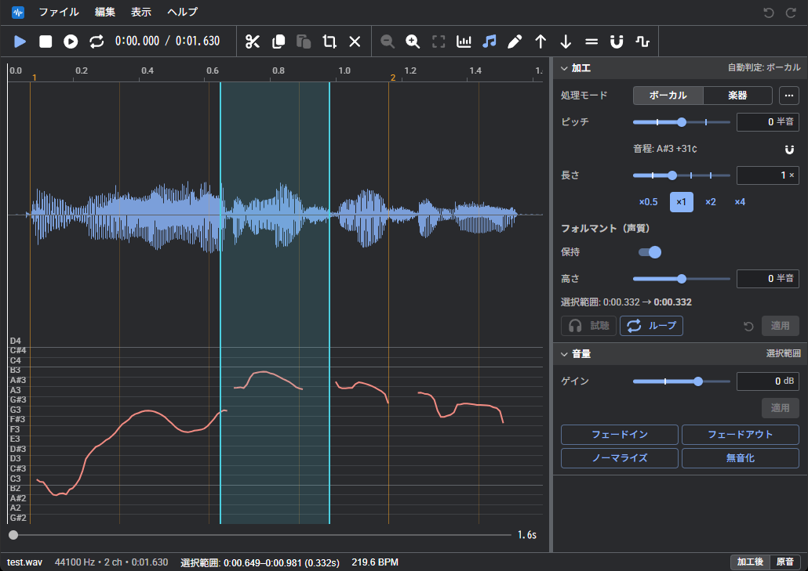
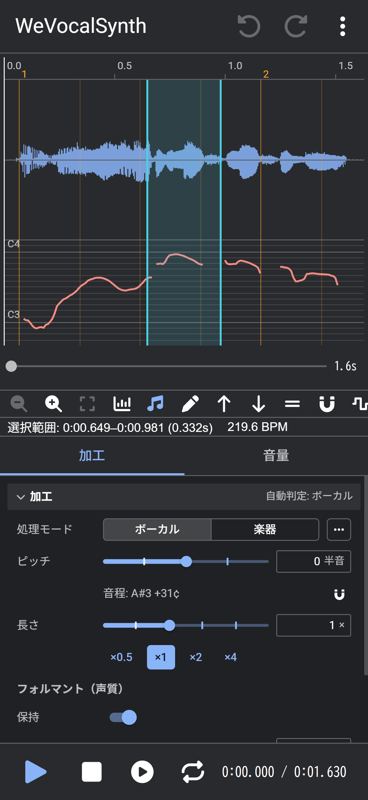

# WeVocalSynth
WeVocalSynthは、Webブラウザ上で音声素材のピッチおよび時間を編集するための音声加工ツールである。

- https://wevocalsynth.pitan76.net/





インストールは不要。音声ファイルはサーバーへ送らず、処理はすべてブラウザ内で行う。

## できること
| 分類 | 機能 |
| --- | --- |
| 加工 | ピッチ変更（0.01半音単位）、時間伸縮、フォルマント保持、移動、ボーカルと楽器のモード、音の種類に合わせて選べる処理方式（Vesola、Solis、Phasera、HPSS など）、逆再生 |
| ピッチ | 範囲の音程の表示と最寄りの音名に合わせる、ピッチ曲線の表示とペンでの描き直し、半音上下、平らにする、音階に揃える、ビブラート、MIDI の音程を当てはめる |
| 編集 | 範囲選択（複数可）、切り取り、コピー、貼り付け（ピッチの曲線にも）、無音の挿入、音量編集、音量とフォルマントの曲線を描く、音符ブロックの移動と伸縮、マーカー、元に戻す、やり直す、操作履歴 |
| トラック | 複数トラック（複製/追加/分割/統合、選択範囲を新しいトラックへ）、トラックごとの音量/パン（非破壊）、ミュート/ソロ、ほかのトラックを重ねて表示、音量メーター |
| 音声の作成 | 声、楽器の音色で、単音または MIDI のメロディから音声を作成（フォルマントと音量を指定、作成前に試聴）、選択範囲を MIDI の音符に並べる、録音 |
| テンポ | BPM自動解析、拍の線と拍への吸着、BPM変更に合わせた全体の伸縮 |
| 確認 | 加工後の試聴、スライダーの操作を即座に反映するループ試聴、原音との比較、帯パネルごとの表示（波形、ピッチ、音量、フォルマント） |
| 保存 | WAV / FLAC / MP3 / Opus / AAC の書き出し、選択範囲をフォルダーへ保存、プロジェクトの保存（.wvsp）、作業の自動保存と復元、保存先の選択と最近使用したファイル（Chrome、Edge） |
| その他 | パソコンとスマホに対応、オフラインで使用できる（PWA）、.wvsp をダブルクリックで開く、日本語、英語、韓国語、中国語（簡体字、繁体字）、ミニマップ、キーの割り当て |
| 試験的機能 | 和音を分離、声から五十音を作る、GPU での加工 |
| 追加機能 | ボーカル抽出、スペクトログラム、動画の書き出し（使用するときだけダウンロードする） |

### 追加機能と関連ツール
追加機能の本体は、別のリポジトリのツールである。どれも単体の Web ツールとして使用でき、画面を持たないライブラリとして WeVocalSynth の追加機能にも組み込んでいる。

| ツール | 単体での用途 | WeVocalSynth での追加機能 |
| --- | --- | --- |
| [WeVocalExtractor](https://github.com/PTOM76/wevocalextractor) | 曲からボーカルと伴奏を取り出す | ボーカル抽出 |
| [WeVocalAnalyzer](https://github.com/PTOM76/wevocalanalyzer) | 声の解析（F0、フォルマント、スペクトログラム、歌詞の文字化） | スペクトログラム |
| [WeVocalConverter](https://github.com/PTOM76/wevocalconverter) | 音声ファイルの形式の変換、動画の書き出し | 動画の書き出し |

## 技術スタック
| 項目 | 内容 |
| --- | --- |
| 画面 | React + TypeScript + MUI（[PevenMUI](https://github.com/PTOM76/pevenmui)、Vite） |
| 音声処理 | Rust → WebAssembly（Web Worker で実行） |
| 再生 | Web Audio API、AudioWorklet |

## セットアップ
```bash
git clone --recursive git@github.com:PTOM76/wevocalsynth.git
cd wevocalsynth
npm install
npm run dev
```

次のフォルダーは submodule。`--recursive` を付け忘れたら `git submodule update --init` で取得する。

| フォルダー | 内容 |
| --- | --- |
| `extractor/` | WeVocalExtractor（ボーカル抽出） |
| `analyzer/` | WeVocalAnalyzer（スペクトログラム） |
| `converter/` | WeVocalConverter（動画の書き出し） |
| `wevocal-lib/` | 共有の信号処理と、音声の読み込み、書き出し |
| `pevenmui/` | 画面の部品 |

`--recursive` だと `extractor/pevenmui/` なども取得されるが、修正するのはルートの `pevenmui/` の方。紛らわしければ、それぞれのフォルダーで `todo setup:nested` を実行して隠す。追加機能を開発サーバーで試すときは、先に `npm run build:addons:dev` を実行する。

音声処理（`dsp/`）を変更するときだけ Rust が必要になる。ビルド済みの `.wasm` をリポジトリに含めているので、画面だけなら Node.js だけで動作する。

[Todofile](https://github.com/Pitan76/Todofile)を導入している場合は、クローン後、`todo setup` と `todo dev` で同様のセットアップが可能。

詳しくは [セットアップ](docs/SETUP.md)

## コードの場所
- 画面: `src/`
  - 組み立ては `src/App.tsx`、状態と操作は `src/hooks/useEditor.ts`
  - 言語ファイル: `src/i18n/`
- 音声処理（Rust）: `dsp/src/`
  - テスト: `dsp/src/tests/`

## ドキュメント
- Wiki: https://doku.wikichree.com/wevocalsynth/start

| ドキュメント名 | リンク先 |
| --- | --- |
| 使い方（利用者向け） | [docs/MANUAL.md](docs/MANUAL.md) |
| 開発環境構築 | [docs/SETUP.md](docs/SETUP.md) |
| 要件定義 | [docs/REQUIREMENT.md](docs/REQUIREMENT.md) |
| 決定事項 | [docs/DECISIONS.md](docs/DECISIONS.md) |
| コーディング規約 | [docs/CODING.md](docs/CODING.md) |
| アーキテクチャ設計 | [docs/ARCHITECTURE.md](docs/ARCHITECTURE.md) |
| ファイル構成 | [docs/STRUCTURE.md](docs/STRUCTURE.md) |
| 機能の仕組み | [docs/INTERNALS.md](docs/INTERNALS.md) |
| プロジェクトファイルの形式 | [docs/PROJECT_FORMAT.md](docs/PROJECT_FORMAT.md) |
| アルゴリズム | [docs/ALGORITHM.md](docs/ALGORITHM.md) |
| 速さの計測 | [docs/PERFORMANCE.md](docs/PERFORMANCE.md) |
| 追加機能とボーカル抽出 | [docs/EXTRACTOR.md](docs/EXTRACTOR.md) |
| バージョン履歴 | [docs/VERSION.md](docs/VERSION.md) |
| ドキュメントの書き方 | [docs/WRITING.md](docs/WRITING.md) |
| 小ネタ | [docs/TIPS.md](docs/TIPS.md) |

## License
This project is licensed under the MIT License.

Third-party software:
- @breezystack/lamejs — LGPL-3.0
- 追加機能に含めて配るもの（ONNX Runtime Web、学習済みモデル、Mediabunny など）は [LICENSE-THIRD-PARTY.md](LICENSE-THIRD-PARTY.md)
