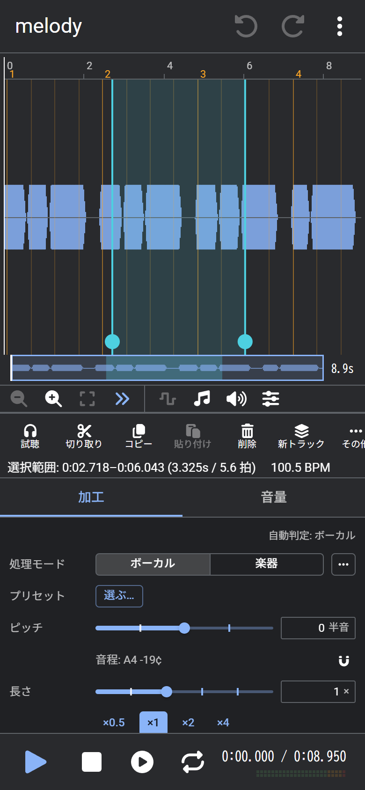
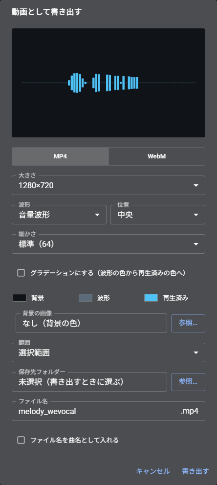

# 使い方
WeVocalSynth の操作方法をまとめた説明書。 
音声ファイルを開き、ピッチ（音の高さ）や長さを変更して書き出すまでの流れと、各機能の使い方を記載する。

## 目次

- [用語](#用語)
- [画面](#画面)
  - [パソコン](#パソコン)
  - [ツールバー](#ツールバー)
  - [スマホ](#スマホ)
- [基本の流れ](#基本の流れ)
- [対応ファイル](#対応ファイル)
- [オフラインとデータの保存](#オフラインとデータの保存)
- [波形の操作](#波形の操作)
  - [無音で区切って選択](#無音で区切って選択)
  - [右クリックのメニュー](#右クリックのメニュー)
- [帯パネルの表示](#帯パネルの表示)
- [加工](#加工)
  - [処理方式（「…」から選択）](#処理方式から選択)
- [ピッチの編集](#ピッチの編集)
  - [ペンで描く](#ペンで描く)
  - [掴んで移動する](#掴んで移動する)
  - [一括で加工する](#一括で加工する)
  - [ピッチが正しく検出されないとき](#ピッチが正しく検出されないとき)
- [音量](#音量)
  - [音量パネル](#音量パネル)
- [フォルマント](#フォルマント)
- [トラック](#トラック)
  - [EQ](#eq)
- [ボーカル抽出](#ボーカル抽出)
- [音声の作成](#音声の作成)
- [録音](#録音)
- [MIDI に並べる](#midi-に並べる)
- [一音ずつ切り出す](#一音ずつ切り出す)
- [テンポ（BPM）と拍の線](#テンポbpmと拍の線)
- [マーカー](#マーカー)
  - [テンポが途中で変わる曲](#テンポが途中で変わる曲)
- [操作履歴](#操作履歴)
- [保存と書き出し](#保存と書き出し)
  - [音声ファイルの書き出し](#音声ファイルの書き出し)
  - [動画の書き出し](#動画の書き出し)
  - [選択範囲をフォルダーへ保存する（Chrome、Edge）](#選択範囲をフォルダーへ保存するchromeedge)
- [試験的機能](#試験的機能)
- [設定](#設定)
  - [設定画面の操作](#設定画面の操作)
  - [ダイアログの操作](#ダイアログの操作)
- [このアプリについて](#このアプリについて)
- [新しいバージョン](#新しいバージョン)
- [キーボード操作](#キーボード操作)
- [困ったとき](#困ったとき)

## 用語

| 用語 | 意味 |
| --- | --- |
| ピッチ | 音の高さ。「半音」単位で上げ下げする（12 半音 = 1 オクターブ） |
| フォルマント | 声質（声の太さ/細さ）を決める成分 |
| 選択範囲 | 波形上でドラッグして選択した部分 |
| 原音 / 加工後 | 開いた時点の音声と、加工を重ねた音声 |
| トラック | 1 つのプロジェクトの中に並べる音声 |
| 帯パネル | 波形/ピッチなどを縦に並べて表示する欄の総称 |

- ピッチのみを上げると、声が細く（子どもらしく）なる。フォルマントを保持すると自然な声になる
- 加工や音量の操作は、選択範囲があればその範囲に、なければ全体に適用される
- 原音と加工後は、ステータスバー（スマホは ⋮ のメニュー）で切り替えて聴き比べられる
- 「トラック」→「原音からトラックを作成」で、選択中のトラックの原音を新しいトラックとして追加できる（加工したトラックのみ）
- 「設定」→「全般」→「編集」→「原音を保持する」を OFF にすると、加工を適用するたびにその結果を原音とする。原音の分のメモリとプロジェクトのサイズを抑えられるが、加工前の音声には戻せない（元に戻す履歴は残る）。このとき、ステータスバーの原音と加工後の切り替えは表示されない
- 編集できるトラックは、選択中の 1 本のみ。その他のトラックは同時に再生される
- 帯パネルは 5 種類ある（[帯パネルの表示](#帯パネルの表示)）

## 画面

### パソコン

| 番号 | 場所 | 内容 |
| --- | --- | --- |
| 1 | メニューバー | ファイル、編集、表示、再生、トラック、ツール、ヘルプ |
| 2 | ツールバー | よく使う操作のボタン（[ツールバー](#ツールバー)） |
| 3 | 時間目盛り | 秒と小節番号。クリック/ドラッグで再生位置を移動する |
| 4 | 波形パネル | 範囲の選択と、再生位置の移動 |
| 5 | 境界 | ドラッグして、上下のパネルの高さを変更する |
| 6 | ピッチパネル | 声の高さの線（[ピッチの編集](#ピッチの編集)） |
| 7 | ミニマップ | 全体を縮小した波形。枠が今の表示範囲、縦線が再生位置で、ドラッグやクリックで移動する。「表示」→「ミニマップ」をオフにすると従来のスクロールバーになる。再生位置の線は「設定」→「表示」→「ミニマップの再生位置」でオン/オフできる |
| 8 | インスペクタ | 加工と音量の設定。境界をドラッグすると幅を変更できる |
| 9 | ステータスバー | プロジェクト名、サンプルレートとチャンネル数、選択範囲、テンポ、処理の進み具合（複数の処理は 1 本にまとめて表示され、クリックすると一覧が表示される） |
| 10 | 加工後 / 原音 | 加工後の音と元の音を切り替えて聴き比べる |

トラックが 2 本以上あるときは、ツールバーの下にトラックの欄も表示される（[トラック](#トラック)）。

メニューバーはキーボードでも操作できる。「ファイル(F)」の F など、括弧内の英字がそのメニューを開くキーである。

| 操作 | 動作 |
| --- | --- |
| Alt（単独で押して離す）/ F10 | メニューバーに移動する。再度押すと解除する |
| メニューバーに移動して英字（括弧の英字） | そのメニューを開く |
| ← / → | 隣のメニューへ移動する |
| ↓ / Enter | 選択中のメニューを開く |
| Esc | メニューを閉じる |
| Alt+英字（例: Alt+F） | メニューを直接開く。アプリとしてインストールして起動しているときのみ（ブラウザのタブでは、ブラウザのメニューと競合するため利用できない） |

英字の下線は、そのキーが利用できるときに表示される。アプリとして起動しているときは常に、ブラウザのタブではメニューバーに移動している間のみ表示される。

| メニュー | 主な項目 |
| --- | --- |
| ファイル(F) | 開く、最近使用したファイル、ファイルをトラックとして追加、プロジェクトを保存、名前を付けて保存、音声ファイルに書き出す、動画ファイルに書き出す（追加機能を導入したとき）、設定 |
| 編集(E) | 元に戻す/やり直す、操作履歴、切り取り/コピー/貼り付け、選択範囲のみ残す、逆再生、無音を挿入、選択範囲を繰り返す、新しいトラックへ（コピー/移動）、マーカー、フェードなどの音量の操作 |
| 表示(V) | 各パネルの表示、ピッチの線と音符、ピッチを波形に重ねる、拡大/縮小、縦の拡大、再生位置に追従 |
| 再生(P) | 再生 / 一時停止、停止、範囲を試聴、ループ再生、先頭へ/末尾へ、前のマーカーへ/次のマーカーへ |
| トラック(R) | ファイルをトラックとして追加、空のトラックを追加、複製、名前の変更、削除、ミュート/ソロ/位相反転、統合（[トラック](#トラック)） |
| ツール(T) | ボーカル抽出、選択範囲を MIDI の音符に並べる、音声の作成、録音 |
| ヘルプ(H) | ユーザーガイド、ショートカット一覧、更新を確認、ライセンス情報、このアプリについて |

ライトテーマの画面（「設定」→「表示」で切り替える）

### ツールバー

アイコンのみのボタンは、マウスカーソルを合わせると名前が表示される。

<b>再生（1〜5）</b>

| 番号 | ボタン | 説明 | キー |
| --- | --- | --- | --- |
| 1 | 再生 / 一時停止 | 音声を再生する。再生中にクリックすると一時停止する | Space |
| 2 | 停止 | 再生を停止し、再生位置を先頭に戻す | |
| 3 | 範囲を試聴 | 選択範囲の音声のみを再生する | |
| 4 | ループ再生 | ON にすると、選択範囲（なければ全体）を繰り返し再生する | |
| 5 | 再生位置 | 現在の再生位置と全体の長さを表示する。クリックすると再生位置を数値で入力できる | |

ループ再生は通常の再生を繰り返すだけなので、その他のトラック/フェーダー/メーターも通常どおり機能する。このボタンは繰り返すかどうかの切り替えであり、再生は再生ボタンで開始する。範囲の外から再生した場合は、末尾まで再生してから範囲の先頭に戻る。加工のスライダーを操作しながら聴く場合は、加工の欄の「ループ」を使用する（[加工](#加工)）。

再生位置の右側は、音量メーターである。再生中にトラックを切り替えても、再生は停止せず同じ位置から継続する。

<b>編集（6〜10）</b>

| 番号 | ボタン | 説明 | キー |
| --- | --- | --- | --- |
| 6 | 切り取り | 選択範囲を切り取る | Ctrl+X |
| 7 | コピー | 選択範囲をコピーする | Ctrl+C |
| 8 | 貼り付け | 再生位置に貼り付ける | Ctrl+V |
| 9 | 選択範囲のみ残す | 選択範囲の外の音声を削除する | |
| 10 | 選択解除 | 選択範囲を解除する | Esc |

<b>表示（11〜19）</b>

| 番号 | ボタン | 説明 | キー |
| --- | --- | --- | --- |
| 11 | 縮小 | 波形を横に縮小し、広い範囲を表示する | Ctrl+ホイール |
| 12 | 拡大 | 波形を横に拡大し、細部を表示する | Ctrl+ホイール |
| 13 | 全体表示 | 音声の全体が収まるように表示する | |
| 14 | 再生位置に追従 | ON の場合、再生中に再生位置が画面外へ移動すると表示が追従する。OFF にすると、再生しながら表示を自由に移動できる | |
| 15 | 波形表示 | 波形パネルの表示/非表示 | |
| 16 | スペクトログラム表示 | スペクトログラムパネルの表示/非表示。追加機能「解析」を導入したときだけ表示される（導入は「表示」メニューの「スペクトログラム」から） | |
| 17 | ピッチ表示 | ピッチパネルの表示/非表示 | |
| 18 | 音量表示 | 音量パネルの表示/非表示 | |
| 19 | フォルマント表示 | フォルマントパネルの表示/非表示 | |

<b>パネルの操作（20〜30）</b>

フォーカスしているパネルに応じて変わる。画像はピッチパネルの場合。

| 番号 | ボタン | 説明 | キー |
| --- | --- | --- | --- |
| 20 | ペン | ピッチを描く | Shift: 半音に揃える Alt: 削除する |
| 21 | 掴む（矢印） | ピッチの線を掴んで上下に移動する（[掴んで移動する](#掴んで移動する)） | Shift: 半音刻み |
| 22 | ↑ | ピッチを半音上げる | ↑（Shift で 0.1 半音） |
| 23 | ↓ | ピッチを半音下げる | ↓（Shift で 0.1 半音） |
| 24 | 平らにする | ピッチの揺れ（ビブラート）を取り除く | |
| 25 | 音階に揃える… | ピッチを指定した音（既定）や最寄りの半音に揃える | |
| 26 | ビブラート… | ピッチに揺れを加える | |
| 27 | MIDI の音程を当てはめる… | ピッチを MIDI ファイルのメロディに合わせる | |
| 28 | 試聴 | 描いたピッチで加工した音を再生する | |
| 29 | 適用 | 描いたピッチを音声に反映する | |
| 30 | 破棄 | 描いたピッチを破棄する | |

22〜27 は選択範囲（なければ全体）に適用される。28〜30 はピッチを描いたときのみ表示される。

音量パネルやフォルマントパネルの場合は、ペンと、描いた曲線を確定するボタンが表示される。

### スマホ

| 番号 | 場所 | 内容 |
| --- | --- | --- |
| 1 / 2 | 元に戻す / やり直す | |
| 3 | メニュー（⋮） | パソコンのメニューバーと同じ「ファイル」「編集」「表示」「再生」「トラック」「ツール」「ヘルプ」。まとまりをタップすると中身に入れ替わり、いちばん上の「‹」で戻る |
| 4 | 時間目盛り | タップで再生位置を移動、ドラッグで再生位置を移動、長押しで横スクロール |
| 5 | 波形パネル | ドラッグで範囲を選択。2 本指のピンチで拡大/縮小、長押しでメニュー |
| 6 | 表示のツール | 拡大/縮小と、パネルの表示の切り替え |
| 7 | 選択範囲とテンポ | タップすると数値で入力できる / テンポを修正できる |
| 8 | タブ | 「加工」と「音量」を切り替える |
| 9 | インスペクタ | 加工/音量の設定（パソコンでは右側にあるもの） |
| 10 | 再生の操作 | 再生と停止、範囲の試聴、ループ再生の切り替え |
| 11 | 再生位置 | 現在の位置 / 全体の長さと、音量メーター |

横向きにすると、左に波形パネルと表示のツール、右に「加工」「音量」のタブが並ぶ（パソコンの画面に近い配置）。

#### 新しい画面と以前の画面

「設定」→「表示」→「スマホの画面」で、新しい画面（既定）と以前の画面を切り替えられる。上の表の 4、5 は以前の画面の操作。

新しい画面では、なぞって範囲を選択すると、下に編集のボタンが表示され、両端のつまみで範囲を調整できる。「範囲の選択」を「長押しで選択」にすると、なぞるとスクロール、長押しで選択になる（下の表）。

| 触れる所 | なぞる | タップ | 長押し（してからなぞる） | 2 本の指 |
| --- | --- | --- | --- | --- |
| 波形パネル | 表示範囲を動かす | 範囲を解除して、再生位置をそこへ | 範囲を選ぶ（震えて合図したら、そのままなぞって広げる） | 拡大/縮小と、表示範囲の移動 |
| 範囲の両端の丸（つまみ） | 端を動かす（拍の線とマーカーに吸着する） | — | — | — |
| 時間目盛り | 再生位置を動かす | 再生位置へ | 表示範囲を横に動かす | 同上 |

- 範囲を選ぶと、波形の下に編集のボタン（試聴、切り取り、コピー、貼り付け、削除、新トラック、その他）が表示される。「その他」は、パソコンの右クリックと同じメニュー（サブメニューはタップすると中に入る）
- トラックの「⋯」で、トラックの右クリックと同じメニューを開く
- ペンや掴むモードのときは、1 本の指で描く、掴む
- 横向きでは、右の欄の左上のボタンで「たたむ」と「固定する」を切り替えられる。たたむと波形が横いっぱいになり、右端の帯をクリックすると欄が上に重なって開く（波形を触ると閉じる）

横向きの画面

## 基本の流れ

1. **開く**: 音声ファイルを画面にドラッグ＆ドロップするか、「ファイル」→「開く…」（Ctrl+O）で開く（[対応ファイル](#対応ファイル)）
2. **範囲を選択する**: 波形上でドラッグする。選択しない場合は全体が対象になる
3. **加工する**: インスペクタの「加工」で、ピッチや長さを設定する
4. **試聴する**: 「試聴」で加工後の音を再生する（20 秒以内の範囲）。「ループ」では範囲を繰り返し再生しながら、スライダーの変更が即座に反映される（簡易的な音質）
5. **適用する**: 「適用」で選択範囲に反映する。元に戻す（Ctrl+Z）で取り消せる
6. **書き出す**: 「ファイル」→「音声ファイルに書き出す…」で、音声ファイルとして保存する

作業内容はブラウザ内に自動で保存され、次回起動時に復元される（[オフラインとデータの保存](#オフラインとデータの保存)）。

## 対応ファイル

| 種類 | 例 |
| --- | --- |
| 音声ファイル | WAV、AIFF、MP3、M4A（AAC）、MP4、FLAC、Ogg（Vorbis/Opus）、WebM（MP4/WebM は音声のみを使用する。FLAC/Ogg/WebM はブラウザによって読み込めない場合がある） |
| 動画ファイル | MP4（音声のみを読み込む） |
| プロジェクトファイル | .wvsp（このアプリで保存したもの） |

- AIFF は非圧縮のもの（整数/浮動小数）に対応する
- 大きなファイルは、読み込み中に進捗が表示される。× で中断できる
- 音声を開いている状態で別の音声ファイルをドロップすると、新しいトラックとして追加される

## オフラインとデータの保存

- 音声は端末の外部に送信されない。処理はすべてブラウザ内で行う
- 一度開いたあとは、オフラインでも利用できる
- ブラウザの「インストール」（ホーム画面に追加）で、アプリとして起動できる
- 作業内容はブラウザ内に自動で保存され、次回起動時に復元される（「設定」→「全般」で無効にできる）
- 自動保存を OFF にしている場合、アプリとして開いていると、未保存の変更があるときに閉じる前に確認が表示される（「設定」→「全般」→「閉じるときに保存を確認する」で無効にできる）。マーカーやテンポだけの変更は、確認の対象にならない
- スマホやタブレットでは、加工したトラックの原音を端末内に退避し、原音を聴くときなどだけ読み込んでメモリを節約する（「設定」→「処理」→「メモリを節約する」）。原音に切り替えた直後は、読み込みの間だけ加工後の音が表示される
- 保存したデータは「設定」→「データ」で確認/削除できる

## 波形の操作

| 操作 | 動作 |
| --- | --- |
| 波形をドラッグ | 範囲を選択する |
| Ctrl（⌘）+ ドラッグ | 範囲を追加で選択する |
| 範囲の端をドラッグ | 範囲を広げる、狭める |
| Shift + 範囲の右端をドラッグ | 範囲の音声を、その長さに伸縮する（ピッチは変わらない） |
| 波形をクリック | 再生位置をその位置へ移動する |
| 時間目盛りをクリック、ドラッグ | 再生位置を移動する（範囲は選択しない） |
| ホイール | 表示を左右にスクロールする |
| Ctrl+ホイール | 表示を拡大、縮小する |
| Alt+ホイール | 波形を縦に拡大、縮小する（最大 64 倍。表示のみで、音声は変わらない） |
| 右クリック（スマホは長押し） | メニューを開く |

ホイールと Ctrl+ホイールの割り当ては、「設定」→「全般」→「キーとマウス」→「ホイールの操作」で入れ替えられる。トラックパッドの横スワイプは、どちらの設定でも左右のスクロールになる。

- 複数の範囲を選択すると、一括で加工できる
- 選択範囲の長さは、秒と拍で表示される（例: 0.934s / 1.8 拍）
- 選択範囲の開始と終了は、ステータスバー（スマホは波形の下）の「選択範囲」をクリックすると数値で入力できる
- ツールバーの再生位置をクリックすると、再生位置を数値で入力できる（「1:23.456」「83.5」など。Enter で移動、Esc で取り消し）
- スマホでは、2 本の指で横に拡大、縮小する。時間目盛りは、タップかドラッグで再生位置を移動し、動かさずに長押しすると横スクロールになる

### 無音で区切って選択

「編集」→「無音で区切って選択」で、音のある所をまとめて選択する。

| 項目 | 内容 |
| --- | --- |
| 無音とみなす音量 | これより小さい音を無音とする（既定 -40dB） |
| 区切りにする無音の長さ | これより短い途切れでは区切らない（既定 200ms） |

選択すると、件数と次の操作（新しいトラックへコピー、別々にフォルダーへ保存）のボタンが通知に表示される。

### 右クリックのメニュー

範囲の試聴、ループ再生、切り取り、コピー、貼り付けと、次のサブメニューがある。最後の「選択範囲を書き出す…」は、範囲を「選択範囲」にして書き出しのダイアログを開く（範囲がなければ「音声ファイルに書き出す…」）。

| サブメニュー | 中身 |
| --- | --- |
| 選択 | すべて選択、無音で区切って選択、選択範囲に合わせて拡大、選択解除 |
| 編集 | 選択範囲のみ残す、逆再生、無音を挿入、選択範囲を繰り返す（元の範囲を含めた回数だけ後ろに並べる） |
| 音量 | フェードイン、フェードアウト、ノーマライズ、無音化 |
| ピッチ（ピッチパネルのみ） | 半音上げる、下げる、揺れを平らにする、音階に揃える、ビブラート、MIDI の音程を当てはめる、ピッチの強制表示、強制非表示、指定の解除 |
| 新しいトラックへ | 選択範囲をコピー、移動 |
| ボーカル抽出 | ボーカルを抽出、伴奏のみ残す、ボーカルと伴奏を別トラックに分離、主旋律、ハモリ、伴奏の 3 トラックに分離、楽器ごとのトラックに分離 |

## 帯パネルの表示

ツールバー（または「表示」メニュー）で、各パネルの表示/非表示を切り替える。上から次の順に並ぶ。少なくとも 1 つは常に表示される。

| パネル | 内容 |
| --- | --- |
| 波形パネル | 音の大きさの形。範囲の選択と再生位置の移動はここで行う |
| スペクトログラムパネル | 周波数ごとの強さを色で表す。追加機能「解析」（約 100KB）を使う。初めて表示するときにダウンロードを確認する画面が表示され、一度ダウンロードすればオフラインでも利用できる |
| ピッチパネル | 声の高さの線と、描いた目標のピッチ（[ピッチの編集](#ピッチの編集)） |
| 音量パネル | 描いた音量の曲線（[音量パネル](#音量パネル)） |
| フォルマントパネル | 描いたフォルマントの移動量（[フォルマント](#フォルマント)） |

クリックしたパネルにフォーカスが移る（左端に色の線が表示される）。ツールバーのパネルごとの操作と、切り取りやコピーは、フォーカスしているパネルが対象になる。たとえばピッチパネルにフォーカスして Ctrl+C を押すと、音声ではなくピッチの線がコピーされる。

上のパネル（波形とスペクトログラム）と下のパネル（ピッチ、音量、フォルマント）の境界をドラッグすると、高さの配分を変更できる。

## 加工

| 項目 | 内容 |
| --- | --- |
| 処理モード | 「ボーカル」は声など単音向け、「楽器」は和音や打楽器向け |
| プリセット | 「選ぶ…」から、保存した加工の設定（ピッチ、長さ、フォルマント、処理方式）を呼び出す。「今の設定を保存…」で名前を付けて保存し、「削除」で削除する。同じ設定で多くの音を加工するときに使う |
| ピッチ | 半音単位で上げ下げする（小数も可） |
| 長さ | 倍率で伸縮する（ピッチは変わらない）。×0.5〜×4 のボタンでも選択できる |
| 拍数 | 拍数を入力して「合わせる」をクリックすると、範囲がその拍数の長さ（プロジェクトの BPM で計算）になる倍率が「長さ」に入力される。対象は最後に選択した範囲（なければ全体） |
| フォルマント | 「保持」で声質を保つ。「高さ」で声質のみを変更する |

- 処理モードは、ファイルを開いたときに自動で判定される。「…」から詳細な処理方式も選択できる
- 「ボーカル」「楽器」で使用する処理方式は、「設定」→「処理」で変更できる（初期値はボーカル＝Vesola、楽器＝Phasera）
- ピッチの下には、範囲の現在の音程と変更後の音名が表示される。磁石のボタンで、変更後の音程を最寄りの音名に合わせる

加工の欄の下部のボタン:

| ボタン | 動作 |
| --- | --- |
| 試聴 | 加工後の音を再生する（20 秒以内の範囲） |
| ループ | 範囲を繰り返し再生する。スライダーを操作すると、即座に音に反映される（簡易的な音質）。再生位置の線が移動し、範囲内をクリックするとその位置へ移る。編集中のトラックのみが再生され、メーターやフェーダーは機能しない |
| ↺（リセット） | ピッチ/長さ/フォルマントの値を初期値に戻す |
| 適用 | 選択範囲（なければ全体）に加工を反映する |

### 処理方式（「…」から選択）

処理方式は、長さの変更だけでなくピッチの変更の音質にも影響する。改良版がある従来の方式（Legacy Solis、Legacy Pisol、Legacy Wevia）は、「設定」→「処理」→「従来の処理方式も表示する」を ON にしたときだけ表示される。

処理方式の一覧

| 方式 | 適した音 |
| --- | --- |
| Solis（SOLA v2） | 声。声の 1 周期ずつ切り貼りするため、大きく伸ばしても荒れにくい。元の声らしさが残る |
| Vesola（SOLA v3） | Solis の改良版。前後数周期を平均し、息や声のざらつきを抑えた滑らかな声にする。ボーカルの既定 |
| Legacy Solis（SOLA） | 声/単音。短いクロスフェードでつなぐため、音のにじみが少ない |
| Pisol（PSOLA v2） | 声。声の周期に合わせて切り貼りする。かすれが生じにくい |
| Legacy Pisol（PSOLA） | 声。声の周期に合わせて切り貼りする |
| Wevia（WSOLA v2） | 子音の多い音声。処理が速い。にじみ/うなりが生じにくい |
| Legacy Wevia（WSOLA） | 子音の多い音声。処理が速い |
| HPSS | 打楽器と和音を分離し、それぞれに適した方法で伸縮する。ドラムを含む曲向け。処理に時間がかかる |
| Phasera v2（PhaseV v2） | Phasera の改良版。打楽器などのアタックがにじみにくい |
| Phasera（PhaseV） | 和音/楽器。滑らかに伸縮する。楽器の既定 |

#### 音の種類ごとの選択の目安

判断に迷う場合は、まず「ボーカル」「楽器」のボタン（既定の方式）で試し、気になる点があれば次の表から選び直す。音の印象は音の種類によって異なるため、試聴で聴き比べるのが確実である。

| 音の種類 | 推奨 | 次の候補 |
| --- | --- | --- |
| 歌声、話し声（声のみ） | Vesola | Solis（元の声らしさを残したいとき） |
| 子音の多い話し声、早口 | Wevia | Solis |
| 単音の楽器（笛、ベースなど） | Solis | Phasera |
| 和音の楽器、パッド、ストリングス（打楽器なし） | Phasera | Phasera v2 |
| ピアノ、ギター（立ち上がりのある和音） | Phasera v2 | Phasera |
| ドラムを含む曲、伴奏 | HPSS | Phasera v2 |
| ドラム、打楽器のみ | Phasera v2 | HPSS |
| ボーカルを含む曲（ミックス） | Phasera | HPSS |

| 気になる点 | 対処 |
| --- | --- |
| 声がかすれる/ざらつく | Vesola か Pisol にする |
| 音がにじむ/こもる/浴室のように響く | 声なら Solis、楽器なら Phasera v2 か HPSS にする |
| ドラムがぼやける/二重に聞こえる | Phasera v2 か HPSS にする |
| 伸ばした和音が一瞬途切れる | Phasera にする（Phasera v2 は立ち上がりで位相をリセットするため） |
| 声がブザーのように聞こえる | Pisol をやめて Solis にする |
| 声を大きく伸ばすと荒れる/ガサガサする | Solis にする |
| 処理に時間がかかる | HPSS 以外にする（その他の方式の 2〜3 倍かかる） |

## ピッチの編集

表示の切り替えで「ピッチ」を ON にすると、波形の下にピッチパネルが表示され、声の高さが線で表される（音名の目盛り付き）。境界をドラッグすると高さを変更できる。

描いたピッチを音声に反映するときの音質は、加工の欄で選んでいる処理方式で変わる。方式の選び方は [処理方式](#処理方式から選択) を参照。

### ペンで描く

ペンのボタンを ON にしてピッチパネルをドラッグすると、目標のピッチを青い線で描ける。

| 操作 | 動作 |
| --- | --- |
| ドラッグ | 描く |
| Shift + ドラッグ | 半音に合わせて描く |
| Alt + ドラッグ | 削除する |

### 掴んで移動する

掴む（矢印）のボタンを ON にすると、ピッチの線を掴んで上下にドラッグできる。線の上にカーソルを合わせると、手の形に変わる。結果は青い線で表示されるため、確認してから「適用」する。

| 操作 | 動作 |
| --- | --- |
| 選択範囲内の線をドラッグ | その範囲のピッチを一括で上下に移動する |
| 選択範囲外の線をドラッグ | 線が途切れる箇所（声のない箇所）までの一続きを上下に移動する |
| Shift + ドラッグ | 半音刻みで移動する |

ペンと掴むは、どちらか一方のみが ON になる。

### 一括で加工する

ツールバーのボタンで、選択範囲（なければ全体）のピッチを一括で加工できる。結果は青い線で表示されるため、確認してから「適用」する。

| ボタン | 動作 |
| --- | --- |
| ↑ / ↓ | 半音上げる/下げる |
| 平らにする | 揺れ（ビブラート）を平滑化して取り除く。「設定」→「処理」→「ピッチ解析」の「「平らにする」の強さ」を下げると、元の揺れを少し残す（機械的すぎない程度に整える） |
| 音階に揃える… | 指定した音（C4 など）や、最寄りの半音に揃える。既定は指定した音 |
| ビブラート… | 深さと速さを指定して、揺れを加える |
| MIDI の音程を当てはめる… | MIDI ファイルのメロディの音程に合わせる |
| 🎧（試聴） | 適用する前に、線を描いた部分を加工して再生する |
| 適用 / 🗑 | 音に反映する / 線を削除する |

ビブラートの速さには、プロジェクトの BPM に合わせた値が初期値として入力される。

「音階に揃える」の「揺れ（ビブラートなど）を残す」は、既定では OFF（揺れも含めて揃える）。ON にすると、音ごとの中心の高さだけを揃え、揺れは元のまま残す。

「音階に揃える」の「揃えるまでの時間」では、音の開始から何ミリ秒かけて揃えるかを設定する。0 では即座に揃い、機械的な声になる。数十ミリ秒にすると、音の開始部分のしゃくりが残り、自然な声になる。

「表示」→「音符」を ON にすると、ピッチパネルに音ごとの高さ（最寄りの半音）が横棒で表示される。音程に揃えた結果の確認に使用する。「表示」→「ピッチの線」と組み合わせて、線のみ/音符のみ/両方を選択できる。

「表示」→「ピッチを波形に重ねる」を ON にすると、ピッチパネルを別の帯に分けず、波形の上に重ねて表示する（波形とピッチの両方を表示しているとき）。波形は薄く表示される。ペンや掴むモードの操作は、波形の上でそのまま行える。

掴むモードで音符を掴むと、その音（声が途切れるか、1 半音以上変化するまで）を編集できる。

| 操作 | 動作 |
| --- | --- |
| 音符を上下にドラッグ | 半音刻みで音程を変更する |
| 音符を左右にドラッグ | 音の位置を移動する |
| 音符の端をドラッグ | 音を伸縮する |

位置と長さを変更すると、即座に音声を伸縮する。隣の無音部分（短い場合は隣の音）が伸縮し、その他の音の位置と全体の長さは変わらない。

端を隣の音の上まで伸ばすと、伸縮は行わず、重なった部分のピッチを掴んだ音の高さで上書きする（結果は青い線で表示されるため、確認してから「適用」する）。

ピッチパネルを選択した状態では、切り取り/コピー/貼り付け（Ctrl+X / C / V）がピッチの線に対して機能する。範囲を選択してコピーし、再生位置に貼り付けると、同じ節回しを別の箇所に使用できる（結果は青い線で表示される）。

「MIDI の音程を当てはめる」の設定項目

| 項目 | 内容 |
| --- | --- |
| MIDI ファイル | 当てはめるメロディのファイル |
| トラック | MIDI 内で使用するトラック |
| 開始位置 | MIDI の 1 音目を合わせる音声上の位置（秒） |
| テンポ | MIDI のテンポを使用するか、プロジェクトの BPM に合わせるか |
| 移調 | MIDI の音程を半音単位で移動する |
| 揺れを残す/強さ | 元の歌い方の揺れをどの程度残すか |

### ピッチが正しく検出されないとき

範囲を選択して右クリックし、「選択範囲のピッチを強制表示」で声のない箇所にもピッチを表示できる（前後の高さから補間する）。誤って検出されたピッチは「強制非表示」で削除できる。

## 音量

インスペクタの「音量」には、3 つの欄がある。

| 欄 | 内容 |
| --- | --- |
| トラック | トラック全体の音量（ゲイン）とパン。音声は書き換えず、再生と書き出しにそのまま反映される |
| 選択範囲 | 範囲の音量とパン。操作すると再生に即座に反映され、「適用」で音声に書き込む（範囲を選択しているときのみ表示される） |
| ボタン | 選択範囲（なければ全体）に即座に適用する |

| ボタン | 動作 |
| --- | --- |
| フェードイン | 徐々に大きくする |
| フェードアウト | 徐々に小さくする |
| ノーマライズ | 最大の箇所が -1 dB（音割れの手前）になるよう、音量を調整する |
| 無音化 | 音を無音にする |

### 音量パネル

ツールバーの「音量表示」で音量パネルを表示し、ペンで音量の曲線（-24〜+12dB）を描ける。描いた音量は再生に即座に反映される。「適用」で音声に書き込み、🗑 で削除する。Shift + ドラッグで 1dB 刻み、Alt + ドラッグで元の音量に戻す。

## フォルマント

ツールバーの「フォルマント表示」でフォルマントパネルを表示し、ペンでフォルマントの移動量（±12 半音）を描ける。声の高さはそのままで、声質（太さ/細さ）のみが変わる。再生には即座に反映されないため、🎧（試聴）で加工して確認してから「適用」する。Shift + ドラッグで半音刻み、Alt + ドラッグで元に戻す。

## トラック

複数の音声を並べ、同時に再生しながら編集できる。トラックが 2 本以上あるときのみ、ツールバーの下にトラックの欄が表示される。

| 番号 | 内容 |
| --- | --- |
| 1 | トラックの名前と音量メーター。編集中のトラックは明るく表示される |
| 2 | M（ミュート）: このトラックを再生しない |
| 3 | S（ソロ）: このトラックのみを再生する |
| 4 | I（位相反転）: 波形の上下を反転して再生する。他のトラックとの打ち消し合いの確認や修正に使用する。書き出しにも反映され、プロジェクトに保存される |
| 5 | トラックの欄を折りたたむ（タブ表示にする）、展開する |
| 6 | トラックの波形。再生されないトラックは薄く表示される |

| 操作 | 動作 |
| --- | --- |
| トラックをクリック | そのトラックを編集する |
| Ctrl（⌘）+ クリック | トラックを 1 本ずつ選択に追加/解除する |
| Shift + クリック | 編集中のトラックから、クリックしたトラックまでを一括で選択する |
| ドラッグ | トラックを並び替える |
| 右クリック | トラックのメニューを開く |

トラックのメニューでできること:

- 名前の変更、複製、削除
- ボーカルと伴奏に分離する
- 直下のトラックと統合する、すべて統合する
- 他のトラックの波形を、大きな波形の背後に重ねて表示する

トラックを右クリックして「このトラックを書き出す…」を選ぶと、そのトラックを選び、書き出す対象を「選択中のトラックのみ」にして書き出しのダイアログを開く。複数選択して右クリックすると、統合、ミュート、ソロ、削除を一括で行える。並び替えは元に戻せる。

「編集」→「無音を挿入…」で、選択範囲の先頭（なければ再生位置）に、秒または拍で指定した長さの無音を挿入する（後続の音声はその分後ろへ移動する）。貼り付けと無音の挿入のあとは、再生位置が挿入した範囲の末尾へ移動する（「設定」→「全般」→「編集」→「波形の挿入後、再生位置を末尾へ移動」で無効にできる。この設定は貼り付けにも適用される）。

「編集」→「新しいトラックへ」→「選択範囲を新しいトラックへコピー」で、選択範囲を同じ時刻のまま新しいトラックにコピーする（その他の部分は無音）。「…へ移動」の場合は、元のトラックのその部分が無音になる。

トラックを追加するには、「ファイル」→「ファイルをトラックとして追加…」を使用するか、音声ファイルをドロップする。「トラック」→「空のトラックを追加」では、選択中のトラックと同じ長さの無音のトラックを追加できる（貼り付け先として使用する）。インスペクタの「音量」の「トラック」で、トラックごとの音量（ゲイン）とパンを設定する。これは音声を書き換えず、再生と書き出しにそのまま反映される。

書き出す際は、全トラックをミックスするか、選択中のトラックのみにするかを選択できる（[保存と書き出し](#保存と書き出し)）。

### EQ

「トラック」→「EQ…」（トラックのメニューからも開ける）で、トラックごとに周波数帯の強さを調整する。音声は書き換えず、再生と書き出しに反映され、プロジェクトに保存される。EQ を使用しているトラックは、トラックの欄の「⋯」に色が付き、メニューの「EQ…」にチェックが付く。

| 項目 | 内容 |
| --- | --- |
| EQ を使用する | オフにすると、設定を残したまま EQ を通さない |
| バンドの数 | 10 バンド（31.5Hz〜16kHz）か 31 バンド（20Hz〜20kHz）。切り替えると、今の曲線に近い値に置き換わる |
| 上限 | 1 バンドの上げ下げの範囲（±12dB か ±24dB） |
| グラフ | なぞると曲線を描ける。Shift を押しながらドラッグすると 1 つのバンドを細かく調整し、Alt を押しながらなぞると周りとなじませる。ダブルクリックで 0dB に戻る |
| 平らにする | すべてのバンドを 0dB に戻す |
| 再生 | EQ を掛けた音を、ダイアログを開いたまま確認する |
| 適用 | EQ をトラックの音声に書き込み、EQ を平らに戻す（元に戻すの対象になる） |

## ボーカル抽出

曲からボーカルのみを抽出したり、伴奏のみを残したりできる。処理はすべてブラウザ内で行う。

| 操作 | 内容 |
| --- | --- |
| 「ツール」→「ボーカル抽出」→「ボーカルを抽出」 | 選択範囲（なければ全体）を、ボーカルのみにする |
| 「ツール」→「ボーカル抽出」→「伴奏のみ残す」 | 選択範囲（なければ全体）を、伴奏のみにする |
| 「ツール」→「ボーカル抽出」→「ボーカルと伴奏を別トラックに分離」 | トラックを、ボーカルと伴奏の 2 本のトラックに置き換える |
| 「ツール」→「ボーカル抽出」→「主旋律、ハモリ、伴奏の 3 トラックに分離」 | トラックを、主旋律、ハモリ、伴奏の 3 本のトラックに置き換える。設定のモデルでボーカルと伴奏に分けてから、ボーカルを主旋律モデル（UVR Karaoke 2、約 53MB の追加機能）で主旋律とハモリに分けるので、時間は約 2 倍かかる |
| 「ツール」→「ボーカル抽出」→「楽器ごとのトラックに分離」 | トラックを、ボーカル、ドラム、ベース、その他の 4 本のトラックに置き換える。設定でモデルを「6 つに分けるモデル」にすると、ギターとピアノも分ける。設定の「ボーカルを主旋律とハモリに分ける」を ON にすると、ボーカルを主旋律とハモリに分ける。モデルは Demucs（約 130〜160MB の追加機能）。曲の長さの数倍の時間がかかり、GPU を使用できない場合は約 6 倍かかる |

初回の利用時は、抽出に使用するデータ（追加機能）のダウンロードを確認する画面が表示される。一度ダウンロードすればオフラインでも利用でき、設定から削除できる。ダウンロード中は画面を閉じても続き、進み具合はステータスバーに表示される。

抽出に使用するデータは、モデルと、計算に使用する実行環境（GPU 用と CPU 用）に分かれている。処理速度を優先するため、既定では GPU 用を使用する。ダウンロードのサイズを抑えたい場合は、「GPU処理を利用する」を OFF にすると、小さい CPU 用を使用する。また、GPU を利用できない環境や、GPU で動作しないモデルを選択した場合は、「GPU処理を利用する」が ON でも CPU 用が必要になり、ダウンロードの確認が表示されることがある。

「設定」→「処理」→「ボーカル抽出」で、次の項目を設定できる。

| 項目 | 内容 |
| --- | --- |
| 利用するモデル | 標準、軽量、高精度（いずれも Spleeter）と、高品質（ボーカル向け、伴奏向け。UVR の MDX-Net）から選択する。Spleeter は軽いほどダウンロードのサイズは小さいが、分離の精度は下がる。高品質は、取り出したい方（ボーカルか伴奏）に合わせて選ぶ。分離の精度は高いが、ダウンロードのサイズが大きく（約 60MB）、GPU を利用できない場合は曲の長さの約 10 倍の時間がかかる。既定は標準。軽量は GPU に対応していないため、選択すると「GPU処理を利用する」は無効になり、CPU で処理する |
| メモリを空けてから抽出する | 抽出の前に作業を保存して開き直し、メモリを空けた状態で抽出する。iPad などで抽出のあとにアプリが終了する場合に使用する。元に戻す履歴は削除される |
| GPU処理を利用する | 対応しているブラウザでは処理が速くなる。OFF にすると、CPU 用の実行環境（GPU 用より小さい）を使用する |
| 高音域を残す | 約 11kHz 以上を残す。声は明るくなるが、シンバルなどが混入しやすい |
| 抽出のメモリの上限 | 抽出の計算に使うメモリの上限（既定 1GB）。iPad などで抽出が失敗するときは下げる |
| 楽器ごとに分けるモデル | 「楽器ごとのトラックに分離」で使用するモデル。4 つに分けるモデル（ボーカル、ドラム、ベース、その他）と、6 つに分けるモデル（ギターとピアノも分ける）から選択する。既定は 4 つ。6 つに分けるモデルのピアノは、ほかの楽器より分離の精度が低い |
| ボーカルを主旋律とハモリに分ける | 「楽器ごとのトラックに分離」で、ボーカルをさらに主旋律モデル（UVR Karaoke 2）で主旋律とハモリに分ける。既定は OFF |

## 音声の作成

「ツール」→「音声を作成…」で、加工に使う音声を生成し、新しいトラックとして追加できる。

| 項目 | 内容 |
| --- | --- |
| 音色 | 声（あいうえお）か、楽器（4 種類の波形） |
| 生成する音 | 単音（音高と長さを指定）か、MIDI ファイルのメロディ |
| フォルマント/音量 | 声質と音量 |
| ビブラート | 揺れの深さ（半音）と速さ（Hz） |

「試聴」で生成前に確認できる。

## 録音
「ツール」→「録音…」（何も開いていないときは画面の「録音」）で、マイクなどから録音する。

- 入力元を選択し、「録音」で開始して「停止」で停止する。メーターが赤くなる場合は、音が割れているので入力の音量を下げる
- 停止したあと「追加」をクリックすると、何も開いていなければ新しいファイルとして開き、開いていれば新しいトラック（「録音 1」…）として追加する。「再録音」でもう一度録音する
- 圧縮しない音（ブラウザの標準のサンプリング周波数。多くは 48kHz）で録音する
- ブラウザが掛ける加工（エコー除去、ノイズ抑制、自動音量調整）は、録音した声を加工に使うため、既定ではオフ。「設定」→「全般」→「録音」で変更できる
- 初回はマイクの使用の許可を求められる。https か localhost で開いているときだけ使用できる

## MIDI に並べる

「ツール」→「選択範囲を MIDI の音符に並べる…」で、選択範囲（なければ全体）を、MIDI の各音符の位置にその高さで配置した新しいトラックを作成する。処理方式とフォルマント保持は、加工の欄の設定を使用する。

| 項目 | 内容 |
| --- | --- |
| トラック/開始位置/テンポ/移調 | MIDI のどのトラックを、どの位置から、どの速さで使用するか |
| 選択範囲の音程 | 選択範囲の元の高さ。選択範囲を解析した値が初期値になる。音符との差の分だけピッチを変更する |
| 長さ | 伸縮: 音符の長さに合わせて伸縮する / 繰り返し: 選択範囲を繰り返して埋める / そのまま: 長さを変えず、音符より長い部分は切り捨てる |

## 一音ずつ切り出す

「ツール」→「一音ずつ切り出し」→「一音ずつ切り出す…」で、歌声を文字にして読みを付け、あ、い、う…の一音ずつの範囲を求める。求めた範囲は、波形の下の読みの帯に表示される。日本語の歌に対応する。

使用するには、追加機能の「歌詞の文字化」と「解析」のダウンロードが必要（初めて使うときに確認のダイアログが表示される）。文字化には WebGPU を使用するため、WebGPU を利用できないブラウザでは使用できない。

1. 選択範囲（なければ全体）が対象になる。伴奏がある場合は、先に[ボーカル抽出](#ボーカル抽出)をすると精度が上がる
2. モデル（軽量、標準、高精度）を選択し、「文字化する」をクリックする。モデルは追加機能として初回だけダウンロードされ（約 120〜560MB）、「設定」→「追加機能」で削除できる
3. 区間ごとの歌詞と読み（ひらがな）が表示される。読みが歌い方と違う場合（「宇宙」を「そら」と歌うなど）は修正する。助詞の「は」「へ」は「わ」「え」として扱われる
4. 「範囲を求める」をクリックすると、読みの帯に一音ずつの範囲が表示される

| 読みの帯の操作 | 内容 |
| --- | --- |
| 音をクリック | その範囲を再生する |
| 端をドラッグ | 範囲を修正する。隣の音と接している端は、隣の音の端も一緒に移動する |
| 色 | 境目がはっきりしない音は、ほかの音と違う色で表示される。修正すると通常の色になる |

読みの帯はトラックごとに保存され、プロジェクトの保存と自動保存に含まれる。切り取り、削除、貼り付け、無音の挿入、伸縮などの編集をすると、範囲も音声に合わせて移動する。元に戻す、やり直すでも一緒に戻る。

| 「ツール」→「一音ずつ切り出し」のメニュー | 内容 |
| --- | --- |
| 一音ずつZIPに書き出す | 一音ずつの WAV を ZIP にまとめて保存する。ファイル名は読み（`あ.wav`）で、同じ音が複数あれば `あ_2.wav` のように番号が付く。前後に 20ms の余白を付け、端をフェードする |
| UTAU音源に書き出す | 音ごとに 1 つ（境目がはっきりしたものを優先）を、ローマ字のファイル名（`ka.wav`）で保存する。`oto.ini`（別名にかなを付けたもの）と `character.txt` を Shift_JIS で含める。先行発声などの値は一律なので、読み込んだソフトで調整する |
| 五十音順にトラックへ並べる | 音ごとに 1 つを五十音順に、0.2 秒の無音を挟んで並べた新しいトラックを作成する。新しいトラックにも読みの帯が付く |
| 読みの帯を削除 | 選択中のトラックの読みの帯を削除する |

書き出しと並べる操作では、無音の音（境目がずれて、声のない所に入ったものなど）は含めない。一音ずつの強さの中央値より 20dB 以上小さい音と、-50dBFS 未満の音を無音とみなす。

## テンポ（BPM）と拍の線

ファイルを開くと、テンポが自動で解析され、BPM と 1 拍目の位置が設定される（設定で無効にできる。無効の場合は「設定」→「処理」→「テンポ」の BPM が使用される）。解析したテンポは、実際の 2 倍や半分になる場合がある。画面下部の BPM の表示（「120 BPM」など）をクリックすると、次の方法で修正できる。

| 方法 | 内容 |
| --- | --- |
| 候補から選択 | 自動解析で検出された候補から選択する |
| ×2 / ÷2 | 現在の BPM を 2 倍/半分にする |
| タップで計測 | 拍に合わせてタップした間隔から BPM を算出する |
| 数値で入力 | BPM を直接入力する |
| 再解析 | 再度自動で解析する |

「設定」→「処理」→「テンポ」→「テンポ変更時に全体を伸縮する」を ON にすると、BPM を数値で入力したときに、全トラックがそのテンポの長さに伸縮する（ピッチは変わらない。処理方式は加工の欄で選択しているもの）。候補からの選択/×2/÷2/タップは、テンポの誤検出を修正する操作のため伸縮しない。元に戻すと音声は復元されるが、BPM は復元されない。

「設定」→「プロジェクト」で BPM、拍子、1 拍目の位置を設定すると、波形に拍の線と小節番号が表示される（拍の線の表示は「設定」→「処理」→「テンポ」で切り替える）。テンポはプロジェクトごとに保存される。範囲の端や再生位置をドラッグすると拍の線に吸着する（Alt を押している間は吸着しない）。

## マーカー

再生位置に名前付きの目印を追加できる（「編集」→「マーカー」→「マーカーを追加」または M キー）。目盛りを右クリックすると、その位置からの再生、再生位置の移動、再生位置の入力、「ここを 1 拍目にする」（拍の線をその位置から数え直す。テンポのマーカーの区間では、そのマーカーを動かす。近くの拍の線に吸着するので、ずらすときは Alt を押しながら右クリックする）、マーカーの追加のほか、その位置にあるマーカーの名前の変更/削除ができる。名前は M1、M2… から始まり、目盛り上の名前をダブルクリックすると変更できる。

- 目盛り上のマーカー（線か名前）をドラッグすると、位置を移動できる（拍の線に吸着する。Alt を押している間は吸着しない）。動かさずにクリックした場合は、再生位置がその位置へ移動する
- 選択範囲の端や再生位置は、近くのマーカーに吸着する（拍の線より優先。Alt を押している間は吸着しない）
- 「再生」→「前のマーカーへ/次のマーカーへ」（Ctrl + ← / →）で移動する
- 名前の変更/削除は、再生位置にあるマーカー、またはそれより前で最も近いマーカーが対象

### テンポが途中で変わる曲

マーカーを右クリックして「ここからテンポを変える…」を選ぶと、そのマーカーの位置からのテンポ（BPM と 1 小節の拍数）を指定できる（「編集」→「マーカー」からも、再生位置にあるマーカーに対して指定できる）。指定したマーカーの位置から拍を数え直し、拍の線、拍への吸着、← → での移動、BPM に合わせる加工（ビブラートの速さ、拍数での長さなど）は、その区間のテンポで計算される。小節の番号は前の区間から続けて数える。

- テンポを指定したマーカーには、名前の後ろにテンポが表示される
- 「テンポを外す」をクリックすると、前のテンポがそのまま続く
- プロジェクトのテンポ（BPM 表示）は、最初のテンポを表す
- プロジェクトに保存される。元に戻す（Ctrl+Z）の対象にはならない

#### テンポの変化の自動検出

ファイルを開いたときのテンポの自動解析で、途中でテンポが変わるかも調べる。変化が見つかった場合は「テンポの変化が検出されました」のダイアログに、変わる位置と BPM の一覧が表示される。

- 行を選択すると、その位置へ再生位置が移動する（聴いて確認できる）
- 「採用する」をクリックすると、変わる位置にテンポ付きのマーカーが配置される（すでにその位置にマーカーがあれば、そのマーカーにテンポを指定する）
- 「一定のテンポにする」をクリックすると、マーカーを配置せずに閉じる（曲全体が最初のテンポのまま）

検出の感度は「設定」→「処理」→「テンポ」→「テンポの変化の検出」で選択する（既定は「控えめ」）。

| 感度 | 内容 |
| --- | --- |
| 検出しない | 途中の変化を調べない |
| 控えめ | 差が 6% 以上で、8 小節以上続く変化だけを検出する（誤検出が少ない） |
| 標準 | 差が 4% 以上で、4 小節以上続く変化を検出する |

倍のテンポや半分のテンポなど、解析で取り違えやすい比の差は、変化とはみなさない。音が小さい区間は判定に使用しない。

## 操作履歴

「編集」→「操作履歴…」で、これまでの操作が一覧で表示される。クリックした操作の直後の状態へ、一括で戻る/進むことができる（「開いたとき」をクリックすると最初の状態に戻る）。

## 保存と書き出し

| 操作 | 内容 |
| --- | --- |
| プロジェクトを保存（Ctrl+S） | 作業内容を .wvsp ファイルに保存する |
| 名前を付けて保存 | 保存先を選び直して .wvsp ファイルに保存する |
| 音声ファイルを書き出す（Ctrl+Shift+S） | 音声をファイルに保存する（[音声ファイルの書き出し](#音声ファイルの書き出し)） |
| 動画ファイルに書き出す… | 音声に波形を付けた動画を保存する（[動画の書き出し](#動画の書き出し)） |

Ctrl+S と Ctrl+Shift+S の割り当ては、「設定」→「全般」→「キーとマウス」で入れ替えられる。

### プロジェクトの保存

- プロジェクトには、原音、加工後の音声、設定が含まれる。加工していないトラックは原音のみを保存する。元に戻す履歴は含まれない
- Chrome と Edge では、開いた .wvsp や一度保存したファイルに、保存先を選ばずに上書きする（初回は書き込みの許可を求められる）
- 保存していない変更があると、ステータスバーのプロジェクト名とタイトルバーに「*」が表示される
- プロジェクト名は、画面左下の名前をクリックするか、「設定」→「プロジェクト」で変更できる

### 音声ファイルの書き出し

| 形式 | 拡張子 | 設定項目 |
| --- | --- | --- |
| WAV | .wav | 16-bit / 24-bit / 32-bit float |
| MP3 | .mp3 | 96〜320 kbps。サンプルレートは 32 / 44.1 / 48 kHz |
| Opus | .ogg | 64〜256 kbps。48 kHz 固定。対応しているブラウザのみ |

| 項目 | 内容 |
| --- | --- |
| サンプルレート、チャンネル | 元のままか、選んだ値。チャンネルはモノラルにもできる |
| 書き出す対象 | 全トラックのミックス（ミュート、ソロに従って再生されるトラックを合成する）か、選択中のトラックのみ。トラックが 2 本以上のときに表示される |
| 範囲 | 全体か選択範囲。範囲を選択して開くと「選択範囲」になる |
| ノーマライズ | 最大の音量を -1dB にそろえる |
| 両端のフェード | 5〜50ms。切り出した音の端のプチッという音を防ぐ |
| 保存先フォルダー | Chrome と Edge のみ。「参照…」で選び、次回も同じフォルダーになる。同じ名前のファイルがあれば、上書きしてよいか確認する |
| ファイル名 | 初期値はプロジェクト名（名前を変更していなければ「元のファイル名_wevocal」） |

- ノーマライズと両端のフェードは、書き出したファイルにのみ反映され、編集中の音声は変わらない。設定は記憶され、フォルダーへの保存にも反映される
- 保存先フォルダーを扱えないブラウザ（Firefox、Safari など）では、ダウンロードとして保存される

### 動画の書き出し

音声に簡易な波形を付けた動画（MP4 または WebM）を保存する。動画の編集はできない。

> この機能は追加機能「変換」で、最初はメニューに表示されない。「設定」→「追加機能」→「変換」でダウンロードすると、「ファイル」→「動画ファイルに書き出す…」が表示される。不要になったら同じ画面で削除できる。

| 項目 | 内容 |
| --- | --- |
| 形式 | MP4 か WebM。ブラウザが作れない形式は選択できない |
| 大きさ | 1280×720、1920×1080、縦（1080×1920）、正方形（1080×1080） |
| 波形 | 音量波形（既定）、その瞬間の波形、全体と再生位置、流れる波形、波形なし |
| 位置 | 中央（既定）か下 |
| 色 | 背景、波形、再生済みの部分 |
| 細かさ | 音量波形の棒の数（32〜512） |
| グラデーションにする | 音量波形を、波形の色から再生済みの色へのグラデーションにする |
| 背景の画像 | 静止画を背景にする。「画面いっぱい」か「全体を収める」で合わせる |
| ファイル名を曲名として入れる | ファイル名を画面に表示する |

- ダイアログの上には、曲の中ほどで音が最も大きいところのフレームのプレビューが表示され、設定を変更すると即座に描き直される
- 範囲、書き出す対象、保存先フォルダー、ノーマライズ、両端のフェードは、音声ファイルの書き出しと同じ
- 設定は次回も同じになる。背景の画像は記憶されない

### 選択範囲をフォルダーへ保存する（Chrome、Edge）

右クリックの「選択範囲をフォルダーへ保存」で、選択範囲を WAV で保存する。保存先は書き出しの「保存先フォルダー」と同じで（未選択なら初回に選ぶ）、「書き出し名_01.wav」「_02.wav」…と、連番の名前になる。

- 選択範囲が 2 つ以上あるときは、「選択範囲を別々にフォルダーへ保存」で、時間の順に 1 つずつ別のファイルにする。「無音で区切って選択」で分けた声を、一括で別々のファイルにするときに使う
- 「設定」→「開発者向け」→「選択範囲の保存ボタンを表示する」を ON にすると、ステータスバーの選択範囲の右に「WAV」が表示される。クリックすると保存し、フォルダーやデスクトップへドラッグしても保存できる（名前は「書き出し名_開始位置ms.wav」）
- ブラウザからのドラッグは仮のファイルとして渡るため、編集ソフトの画面へ直接ドロップしても受け取られない。編集ソフトでは、保存先のフォルダーを開いておくと、保存した音を即座に並べられる

### 保存先とファイルの開き方

- Chrome と Edge では、保存や書き出しのときに保存先を選ぶ画面が表示される。Firefox と Safari では、ダウンロードとして保存される
- 開く場所と保存先は、プロジェクトと音声ファイルで別々に記憶される。「設定」→「全般」→「ファイル」→「開く場所と保存先を記憶する」を OFF にすると、毎回「最初に開くフォルダ」から開く
- 「ファイル」→「最近使用したファイル」から、最近開いたファイルや保存したプロジェクト（最大 8 件）を開き直せる。何も開いていないときの最初の画面にも 3 件表示される（Chrome と Edge のパソコン版のみ。開くときに読み込みの許可を求められる場合がある）
- スマホやタブレットでは、Google ドライブや外部のファイルマネージャーから選べるよう、従来のファイル選択を使用する（「設定」→「開発者向け」→「ファイル選択の方式」で切り替えられる）
- アプリとしてインストールすると（Chrome と Edge のパソコン版）、.wvsp をダブルクリックして開けるようになる。このときは前回の作業を復元しない。音声ファイル（.mp3 など）の開き方は変わらない

## 試験的機能

開発中の機能。「設定」→「開発者向け」→「試験的機能」で ON にすると使用できる。結果の品質や動作は、今後変わる場合がある。

| 機能 | 設定の項目 | 内容 |
| --- | --- | --- |
| 試験的な処理方式 | 試験的な処理方式を使用する | 加工の欄の「…」の処理方式に Specraw が表示される。ピッチや長さを何度も変更しても劣化しにくいことを目指している |
| 和音を分ける | 「和音を分ける」を表示する | 2 つの声が重なった音を、2 本のトラックに分ける |
| 声から五十音を作る | 声から五十音を作る（試験的） | 1 つの母音の声から、ほかの母音を作る |
| GPUでの並列処理 | GPUでの並列処理を有効にする | 長い音のピッチ変更を区間に分けて、同時に処理する |

### 和音を分ける

「ツール」→「試験的機能」（右クリックでは「ボーカル抽出」→「試験的機能」）に、次の 2 つが表示される。選択範囲があればその範囲だけ、なければ全体を分ける。

| 項目 | 分け方 |
| --- | --- |
| 和音を高い方と低い方に分ける | 音の高さで分ける。ハモリを主旋律から分けるときなど |
| 和音を大きい方と小さい方に分ける | 音の大きさで分ける |

- 2 つの声の単純な和音に向いている。3 つ以上の声や、伴奏を含む曲はうまく分けられない
- 1 オクターブ以上離れた 2 つの声は分けられない
- 分けたあとは、それぞれのトラックでピッチなどを加工できる

### 声から五十音を作る

「ツール」→「試験的機能」→「母音からあいうえおを作る」で、元にする母音（「あ」の声から、など）を選ぶ。選択範囲（なければ全体）の声を元に、「あいうえお」を並べた新しいトラック（「名前（あいうえお）」）を作る。

- 声の質はそのままで、響き（フォルマント）だけを変えて別の母音にする
- 「設定」→「開発者向け」→「試験的機能」→「響きを変える強さ」（50〜100%）を弱めると、母音らしさは減るが、元の声質が残る

### GPUでの並列処理

20 秒以上の音のピッチ変更を、10 秒ずつの区間に分けて、複数のコアで同時に処理する。長い曲のピッチを変更するときに速くなる。

- 区間の境目は波形の位相を合わせてつなぐ。区間ごとに最大 5ms ずれる
- ピッチ曲線の編集と、テンポに合わせた伸縮には使用されない

## 設定

「ファイル」→「設定…」（スマホは「⋮」→「設定」）。

| 分類 | 項目 |
| --- | --- |
| プロジェクト | プロジェクト名、BPM、拍子、1 拍目の位置 |
| 全般 | 自動保存、閉じるときに保存を確認する、音声の出力先（Chrome、Edge のみ。デバイス名が表示されない場合は「名前を表示」をクリックし、マイクの使用を許可する）、音量の上限（既定はオン、-1dB。大きすぎる音を抑える。書き出す音には反映されない）、録音（エコー除去、ノイズ抑制、自動音量調整。既定はすべてオフ）、更新の確認 |
| 全般 → 編集 | 原音を保持する、元に戻せる回数とメモリ、ダブルクリックでスライダーを既定値に戻す、波形の挿入後に再生位置を末尾へ移動 |
| 全般 → キーとマウス | ホイールの操作、Ctrl+S の動作、ショートカットの割り当て |
| 全般 → ファイル | 開く場所と保存先の記憶、最初に開くフォルダ、最近使用したファイルの記録（Chrome、Edge のみ） |
| 表示 | テーマ（ライト、ダーク、ブラウザに合わせる）、言語、画面の大きさ（文字、入力欄、ボタンなどをまとめて 90〜150% に拡大、縮小する）、音量メーター、範囲選択中も数値を更新、ミニマップの再生位置 |
| 処理 | ボーカル/楽器のモードで使用する処理方式、従来の処理方式も表示する、開いたときの処理モード、メモリを節約する |
| 処理 → ピッチ解析 | 解析する音域、声と判定する基準の厳しさ、無音と判定する音量（変更すると再解析する）、「平らにする」の強さ |
| 処理 → テンポ | 開いたときの自動解析、テンポを自動解析しないときの BPM、拍の線の表示、テンポ変更時に全体を伸縮する |
| 処理 → ボーカル抽出 | モデル、メモリを空けてから抽出する、GPU、高音域を残す、抽出のメモリの上限、楽器ごとに分けるモデル、ボーカルを主旋律とハモリに分ける（モデルのダウンロードと削除は「追加機能」） |
| 追加機能 | ボーカル抽出のモデル、解析（スペクトログラム）、変換（動画の書き出し）のダウンロードと削除 |
| データ | ブラウザ内の使用量の確認、保存したデータの削除、データを削除されにくくする申請 |
| 開発者向け | デバッグ表示（Ctrl+Shift+D でも切り替え。再生に使う AudioContext の状態も表示する）、開発版の更新を受け取る、選択範囲の保存ボタンを表示する、ファイル選択の方式（書き出しの保存先フォルダーを使うかもこれで決まる）、ダイアログの表示 |
| 開発者向け → 音声処理 | フォルマント補正の高速計算、ループ試聴の位置合わせ、継ぎ目のフェード、停止中は音声処理を一時停止する、iOS の消音スイッチ ON でも再生する |
| 開発者向け → 試験的機能 | 試験的な処理方式を使用する（Specraw。往復や重ねた加工で劣化しにくいことを目指す、開発中の方式）、「和音を分ける」を表示する（2 つの声を、高い方と低い方、または大きい方と小さい方の 2 つのトラックに分ける。選択範囲があれば、その範囲だけ。単純な和音向け）、GPUでの並列処理を有効にする（20 秒以上の音のピッチ変換を 10 秒ずつに分け、CPU の複数のコアで同時に行う。区間ごとに最大 5ms ずれる） |
| 開発者向け → 診断 | ボーカル抽出の診断 |

「追加機能」では、ボーカル抽出のモデル、解析、変換のダウンロードと削除ができる。ダウンロードしたものはオフラインでも使用できる。

「全般」と「処理」の下の分類は、一覧で親の分類の下に表示される。「全般」→「ファイル」は Chrome、Edge のパソコン版のみ表示される。

### 設定画面の操作

| 操作 | 動作 |
| --- | --- |
| 検索欄に入力 | 名前や説明に一致する項目を検索する |
| ↑ / ↓/Home / End | 分類を切り替える（分類の一覧にフォーカスがあるとき） |
| Tab | 分類の一覧から右側の項目へ移動する |
| Enter | OK（設定を確定して閉じる） |
| Esc | 検索語を消去する。検索語がない場合は、設定画面を閉じる |

- パソコンでは、OK をクリックせずに閉じると、変更内容は破棄される
- スマホでは、分類の一覧から各画面へ移動する。変更内容は即座に反映される
- 「プロジェクト」の分類のみ、パソコンでも変更した時点で反映される

### ダイアログの操作

書き出しや音声の作成などのダイアログでは、Enter で主要なボタン（「書き出す」「作成」など）を実行し、Esc で閉じる。Tab でボタンにフォーカスを移して Enter を押すと、そのボタンが実行される。

設定/書き出し/音声の作成/ヘルプ（ショートカット一覧、このアプリについて）は、アプリとしてインストールして Chrome や Edge で使用しているときは、別ウィンドウ（ポップアップ）で開く。それ以外ではページ内のダイアログで開く。「設定」→「開発者向け」→「ダイアログの表示」で表示方法を固定できる。

| 表示方法 | 内容 |
| --- | --- |
| 自動 | 上記のとおり（既定） |
| ダイアログ / `<dialog>` / Popover API | ページ内に表示する。Popover API は開いたまま背後も操作できる |
| ポップアップ / 別タブ | 別ウィンドウ/別タブに表示する |
| サブウィンドウ | 別ウィンドウに表示し、位置を記憶する（別のディスプレイにも配置できる。初回に許可を求められる） |
| PiP | 常に最前面に表示される小さなウィンドウに表示する |

別ウィンドウを開けない場合は、ページ内のダイアログで表示する。

## このアプリについて

「ヘルプ」→「このアプリについて」で、バージョン、作者、ライセンスを確認できる。

## 新しいバージョン

新しいバージョンが公開されると、画面の右下に「新しいバージョンがあります」と表示される。「更新」をクリックすると切り替わる（作業内容は自動保存から復元される）。× で通知を閉じられる。「ヘルプ」→「更新を確認」や、「設定」→「全般」の「今すぐ確認」でも確認でき、新しいバージョンがあればそこから更新できる。

## キーボード操作

| キー | 動作 |
| --- | --- |
| Space | 再生 / 一時停止 |
| Ctrl+Z / Ctrl+Y（Ctrl+Shift+Z） | 元に戻す / やり直す |
| Ctrl+X / C / V | 切り取り / コピー / 再生位置に貼り付け |
| Ctrl+A / Esc | すべて選択 / 選択解除 |
| Ctrl+O | 開く |
| ← / → | 再生位置を 1 拍ずつ移動する |
| Shift+← / → | 再生位置を 0.1 秒ずつ移動する |
| Home / End | 再生位置を先頭 / 末尾へ移動する |
| M | 再生位置にマーカーを追加する |
| Ctrl + ← / → | 前 / 次のマーカーへ移動する |
| ↑ / ↓ | 加工のピッチを ±1 半音（Shift で ±12 半音）。ピッチパネルでは、選択範囲のピッチを半音（Shift で 0.1 半音）上げる / 下げる |
| Tab / Shift + Tab | 次 / 前の選択範囲を選び、その頭へ移動する（選択範囲が 2 つ以上のとき） |
| Alt + ホイール | 波形を縦に拡大/縮小する |
| Ctrl+S | プロジェクトを保存 |
| Ctrl+Shift+S / Ctrl+E | 音声ファイルを書き出す |
| Alt / F10 → 英字 | メニューバーに移動し、「ファイル(F)」の F などでそのメニューを開く（[パソコン](#パソコン)） |
| Alt+英字 | メニューを直接開く（アプリとしてインストールして起動しているときのみ） |

- 切り取り、コピー、貼り付けは、フォーカスしているパネルが対象になる。ピッチパネルの場合は、ピッチの線が対象になる
- ← / → は、拍の線を表示していないときは 1 秒ずつ移動する
- Ctrl+S と Ctrl+Shift+S の割り当ては、設定で入れ替えられる
- 表のキーは既定の割り当て。「設定」→「全般」→「キーとマウス」で、操作ごとにキーを変更できる（ボタンをクリックしてから、割り当てるキーを押す。Esc で取り消す）。ほかの操作で使用しているキーを割り当てると、そちらの割り当ては解除される
- 範囲を試聴、ループ再生、加工を適用、選択範囲を新しいトラックへ、選択範囲をフォルダーへ保存、選択範囲のみ残す、無音で区切って選択には、既定のキーがない。切り出しと加工を繰り返すときは、押しやすいキーを割り当てると効率がよい
- メニューの右のキーと「ヘルプ」→「ショートカット」の一覧は、変更した割り当てで表示される

一覧は「ヘルプ」→「ショートカット」でも確認できる。

## 困ったとき

| 症状 | 対処 |
| --- | --- |
| 「試聴」をクリックできない | 範囲を 20 秒以内/1 つにする。長い場合は「ループ」で再生する |
| 加工後の声がこもる/機械的になる | 処理方式を変更する（「…」）。声の場合は「フォルマント保持」を ON にする |
| ピッチの線が途切れる | 範囲を選択し、右クリックの「選択範囲のピッチを強制表示」で補間する |
| 前回の作業が自動で復元される | 「設定」→「全般」の「作業を自動保存し、次回開いたときに復元する」を OFF にする |
| ボーカル抽出で声と伴奏が正しく分離されない | 「設定」→「処理」→「ボーカル抽出」でモデルを「高精度」か「高品質」に変更する |
| 抽出した声にシンバルなどが混入する | 「高音域を残す」を OFF にする |
| 抽出した声がこもって聞こえる | 「高音域を残す」を ON にする |
| ボーカル抽出が遅い | モデルを「軽量」にするか、「GPU処理を利用する」を ON にする |
| ボーカル抽出が失敗する/結果が不正確 | 「GPU処理を利用する」を OFF にする |
| 抽出のあとにアプリが終了し、抽出の前に戻る | 「メモリを空けてから抽出する」を ON にする（終了したことを検知すると、次の起動時に確認が表示される） |
| ファイルを開けない | WAV か MP3 に変換してから開く |
| iPhone / iPad で音が再生されない | 「設定」→「開発者向け」の「停止中は音声処理を一時停止する」を OFF にする。「開発者向け」→「デバッグ表示」を ON にし、左下の「audio」の行が running 以外なら、その内容を報告する |
