# 使い方
WeVocalSynth の操作方法をまとめた説明書。 
音声ファイルを開き、ピッチ（音の高さ）や長さを変更して書き出すまでの流れと、各機能の使い方を記載する。

## 目次

- [用語](#用語)
- [画面](#画面)
  - [パソコン](#パソコン)
  - [ツールバー](#ツールバー)
  - [スマホ](#スマホ)
- [基本の流れ](#基本の流れ)
- [対応ファイル](#対応ファイル)
- [オフラインとデータの保存](#オフラインとデータの保存)
- [波形の操作](#波形の操作)
- [帯パネルの表示](#帯パネルの表示)
- [加工](#加工)
  - [処理方式（「…」から選択）](#処理方式から選択)
- [ピッチの編集](#ピッチの編集)
  - [ペンで描く](#ペンで描く)
  - [掴んで移動する](#掴んで移動する)
  - [一括で加工する](#一括で加工する)
  - [ピッチが正しく検出されないとき](#ピッチが正しく検出されないとき)
- [音量](#音量)
  - [音量パネル](#音量パネル)
- [フォルマント](#フォルマント)
- [トラック](#トラック)
- [ボーカル抽出](#ボーカル抽出)
- [音声の作成](#音声の作成)
- [MIDI に並べる](#midi-に並べる)
- [テンポ（BPM）と拍の線](#テンポbpmと拍の線)
- [マーカー](#マーカー)
- [操作履歴](#操作履歴)
- [保存と書き出し](#保存と書き出し)
- [設定](#設定)
  - [設定画面の操作](#設定画面の操作)
  - [ダイアログの操作](#ダイアログの操作)
- [このアプリについて](#このアプリについて)
- [新しいバージョン](#新しいバージョン)
- [キーボード操作](#キーボード操作)
- [困ったとき](#困ったとき)

## 用語

| 用語 | 意味 |
| --- | --- |
| ピッチ | 音の高さ。「半音」単位で上げ下げする（12 半音 = 1 オクターブ） |
| フォルマント | 声質（声の太さ/細さ）を決める成分 |
| 選択範囲 | 波形上でドラッグして選択した部分 |
| 原音 / 加工後 | 開いた時点の音声と、加工を重ねた音声 |
| トラック | 1 つのプロジェクトの中に並べる音声 |
| 帯パネル | 波形/ピッチなどを縦に並べて表示する欄の総称 |

- ピッチのみを上げると、声が細く（子どもらしく）なる。フォルマントを保持すると自然な声になる
- 加工や音量の操作は、選択範囲があればその範囲に、なければ全体に適用される
- 原音と加工後は、ステータスバー（スマホは ⋮ のメニュー）で切り替えて聴き比べられる
- 編集できるトラックは、選択中の 1 本のみ。その他のトラックは同時に再生される
- 帯パネルは 5 種類ある（[帯パネルの表示](#帯パネルの表示)）

## 画面

### パソコン

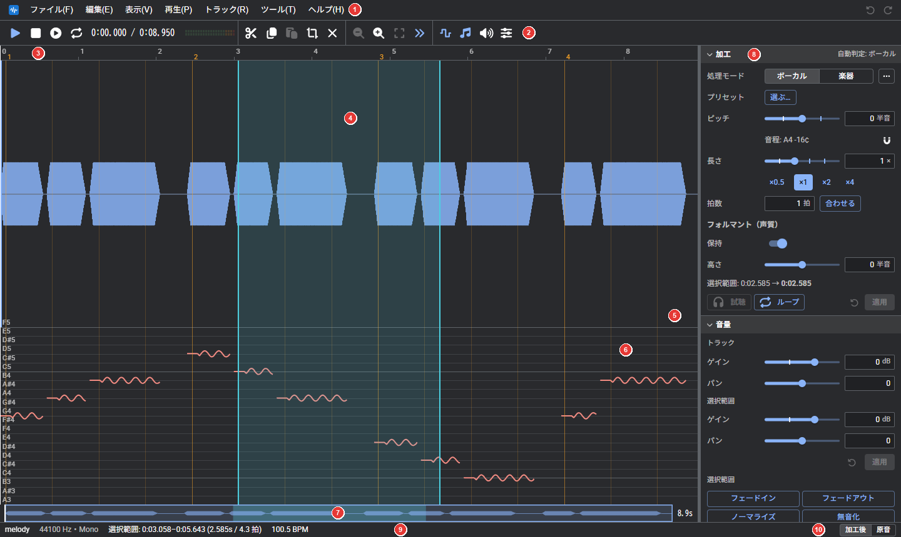

| 番号 | 場所 | 内容 |
| --- | --- | --- |
| 1 | メニューバー | ファイル、編集、表示、再生、トラック、ツール、ヘルプ |
| 2 | ツールバー | よく使う操作のボタン（[ツールバー](#ツールバー)） |
| 3 | 時間目盛り | 秒と小節番号。クリック/ドラッグで再生位置を移動する |
| 4 | 波形パネル | 範囲の選択と、再生位置の移動 |
| 5 | 境界 | ドラッグして、上下のパネルの高さを変更する |
| 6 | ピッチパネル | 声の高さの線（[ピッチの編集](#ピッチの編集)） |
| 7 | スクロールバー | 拡大表示中に、表示範囲を移動する |
| 8 | インスペクタ | 加工と音量の設定。境界をドラッグすると幅を変更できる |
| 9 | ステータスバー | プロジェクト名、選択範囲、テンポ、処理の進捗 |
| 10 | 加工後 / 原音 | 加工後の音と元の音を切り替えて聴き比べる |

トラックが 2 本以上あるときは、ツールバーの下にトラックの欄も表示される（[トラック](#トラック)）。

メニューバーはキーボードでも操作できる。「ファイル(F)」の F など、括弧内の英字がそのメニューを開くキーである。

| 操作 | 動作 |
| --- | --- |
| Alt（単独で押して離す）/ F10 | メニューバーに移動する。再度押すと解除する |
| メニューバーに移動して英字（括弧の英字） | そのメニューを開く |
| ← / → | 隣のメニューへ移動する |
| ↓ / Enter | 選択中のメニューを開く |
| Esc | メニューを閉じる |
| Alt+英字（例: Alt+F） | メニューを直接開く。アプリとしてインストールして起動しているときのみ（ブラウザのタブでは、ブラウザのメニューと競合するため利用できない） |

英字の下線は、そのキーが利用できるときに表示される。アプリとして起動しているときは常に、ブラウザのタブではメニューバーに移動している間のみ表示される。

| メニュー | 主な項目 |
| --- | --- |
| ファイル(F) | 開く、最近使用したファイル、ファイルをトラックとして追加、プロジェクトを保存、音声ファイルを書き出す、設定 |
| 編集(E) | 元に戻す/やり直す、操作履歴、切り取り/コピー/貼り付け、逆再生、フェードなどの音量の操作 |
| 表示(V) | 各パネルの表示、拡大/縮小、再生位置に追従、音量メーター |
| 再生(P) | 再生 / 一時停止、停止、範囲を試聴、ループ再生、先頭へ/末尾へ |
| トラック(R) | 追加、複製、名前の変更、削除、ミュート/ソロ/位相反転、統合（[トラック](#トラック)） |
| ツール(T) | ボーカル抽出、音声の作成 |
| ヘルプ(H) | ユーザーガイド、ショートカット一覧、更新を確認、このアプリについて |

ライトテーマの画面（「設定」→「表示」で切り替える）

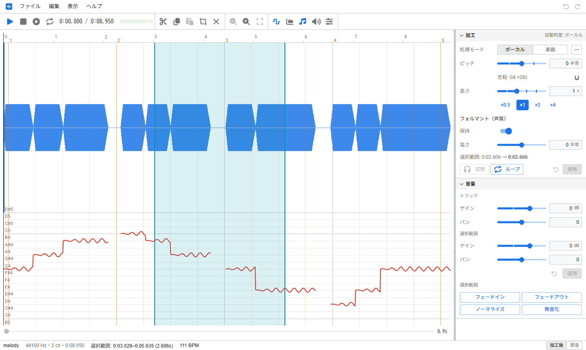

### ツールバー

アイコンのみのボタンは、マウスカーソルを合わせると名前が表示される。

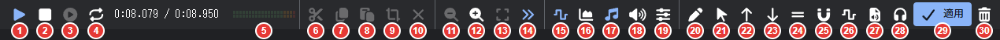

<b>再生（1〜5）</b>

| 番号 | ボタン | 説明 | キー |
| --- | --- | --- | --- |
| 1 | 再生 / 一時停止 | 音声を再生する。再生中にクリックすると一時停止する | Space |
| 2 | 停止 | 再生を停止し、再生位置を先頭に戻す | |
| 3 | 範囲を試聴 | 選択範囲の音声のみを再生する | |
| 4 | ループ再生 | ON にすると、選択範囲（なければ全体）を繰り返し再生する | |
| 5 | 再生位置 | 現在の再生位置と全体の長さを表示する。クリックすると再生位置を数値で入力できる | |

ループ再生は通常の再生を繰り返すだけなので、その他のトラック/フェーダー/メーターも通常どおり機能する。このボタンは繰り返すかどうかの切り替えであり、再生は再生ボタンで開始する。範囲の外から再生した場合は、末尾まで再生してから範囲の先頭に戻る。加工のスライダーを操作しながら聴く場合は、加工の欄の「ループ」を使用する（[加工](#加工)）。

再生位置の右側は、音量メーターである。再生中にトラックを切り替えても、再生は停止せず同じ位置から継続する。

<b>編集（6〜10）</b>

| 番号 | ボタン | 説明 | キー |
| --- | --- | --- | --- |
| 6 | 切り取り | 選択範囲を切り取る | Ctrl+X |
| 7 | コピー | 選択範囲をコピーする | Ctrl+C |
| 8 | 貼り付け | 再生位置に貼り付ける | Ctrl+V |
| 9 | 選択範囲のみ残す | 選択範囲の外の音声を削除する | |
| 10 | 選択解除 | 選択範囲を解除する | Esc |

<b>表示（11〜19）</b>

| 番号 | ボタン | 説明 | キー |
| --- | --- | --- | --- |
| 11 | 縮小 | 波形を横に縮小し、広い範囲を表示する | Ctrl+ホイール |
| 12 | 拡大 | 波形を横に拡大し、細部を表示する | Ctrl+ホイール |
| 13 | 全体表示 | 音声の全体が収まるように表示する | |
| 14 | 再生位置に追従 | ON の場合、再生中に再生位置が画面外へ出ると表示が追従する。OFF にすると、再生しながら表示を自由に移動できる | |
| 15 | 波形表示 | 波形パネルの表示/非表示 | |
| 16 | スペクトログラム表示 | スペクトログラムパネルの表示/非表示 | |
| 17 | ピッチ表示 | ピッチパネルの表示/非表示 | |
| 18 | 音量表示 | 音量パネルの表示/非表示 | |
| 19 | フォルマント表示 | フォルマントパネルの表示/非表示 | |

<b>パネルの操作（20〜30）</b>

フォーカスしているパネルに応じて変わる。画像はピッチパネルの場合。

| 番号 | ボタン | 説明 | キー |
| --- | --- | --- | --- |
| 20 | ペン | ピッチを描く | Shift: 半音に揃える Alt: 削除する |
| 21 | 掴む（矢印） | ピッチの線を掴んで上下に移動する（[掴んで移動する](#掴んで移動する)） | Shift: 半音刻み |
| 22 | ↑ | ピッチを半音上げる | ↑（Shift で 0.1 半音） |
| 23 | ↓ | ピッチを半音下げる | ↓（Shift で 0.1 半音） |
| 24 | 平らにする | ピッチの揺れ（ビブラート）を取り除く | |
| 25 | 音階に揃える… | ピッチを指定した音（既定）や最寄りの半音に揃える | |
| 26 | ビブラート… | ピッチに揺れを加える | |
| 27 | MIDI の音程を当てはめる… | ピッチを MIDI ファイルのメロディに合わせる | |
| 28 | 試聴 | 描いたピッチで加工した音を再生する | |
| 29 | 適用 | 描いたピッチを音声に反映する | |
| 30 | 破棄 | 描いたピッチを破棄する | |

22〜27 は選択範囲（なければ全体）に適用される。28〜30 はピッチを描いたときのみ表示される。

音量パネルやフォルマントパネルの場合は、ペンと、描いた曲線を確定するボタンが表示される。

### スマホ

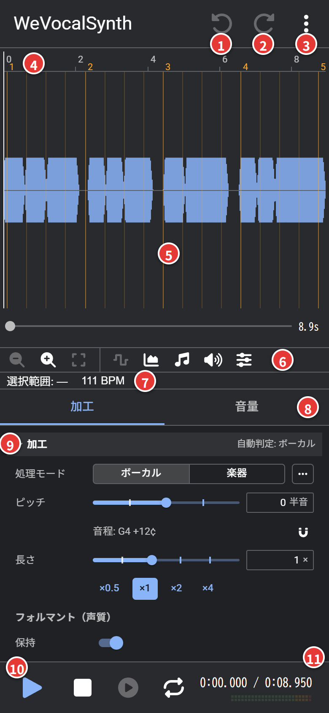

| 番号 | 場所 | 内容 |
| --- | --- | --- |
| 1 / 2 | 元に戻す / やり直す | |
| 3 | メニュー（⋮） | ファイルを開く、保存する、設定を開くなど |
| 4 | 時間目盛り | タップで再生位置を移動、ドラッグで再生位置を移動、長押しで横スクロール |
| 5 | 波形パネル | ドラッグで範囲を選択。2 本指のピンチで拡大/縮小、長押しでメニュー |
| 6 | 表示のツール | 拡大/縮小と、パネルの表示の切り替え |
| 7 | 選択範囲とテンポ | タップすると数値で入力できる / テンポを修正できる |
| 8 | タブ | 「加工」と「音量」を切り替える |
| 9 | インスペクタ | 加工/音量の設定（パソコンでは右側にあるもの） |
| 10 | 再生の操作 | 再生と停止、範囲の試聴、ループ再生の切り替え |
| 11 | 再生位置 | 現在の位置 / 全体の長さと、音量メーター |

横向きにすると、左に波形パネルと表示のツール、右に「加工」「音量」のタブが並ぶ（パソコンの画面に近い配置）。

横向きの画面

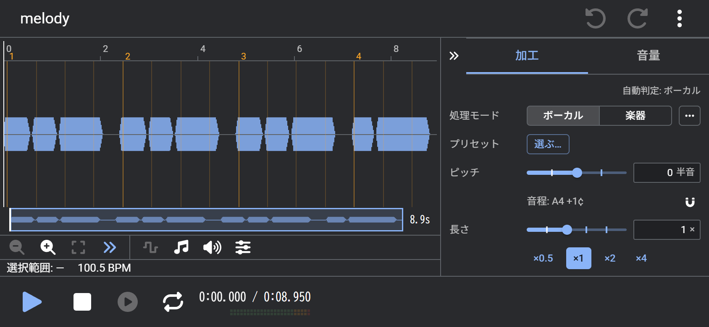

## 基本の流れ

1. **開く**: 音声ファイルを画面にドラッグ＆ドロップするか、「ファイル」→「開く…」（Ctrl+O）で開く（[対応ファイル](#対応ファイル)）
2. **範囲を選択する**: 波形上でドラッグする。選択しない場合は全体が対象になる
3. **加工する**: インスペクタの「加工」で、ピッチや長さを設定する
4. **試聴する**: 「試聴」で加工後の音を再生する（20 秒以内の範囲）。「ループ」では範囲を繰り返し再生しながら、スライダーの変更が即座に反映される（簡易的な音質）
5. **適用する**: 「適用」で選択範囲に反映する。元に戻す（Ctrl+Z）で取り消せる
6. **書き出す**: 「ファイル」→「音声ファイルを書き出す…」で、音声ファイルとして保存する

作業内容はブラウザ内に自動で保存され、次回起動時に復元される（[オフラインとデータの保存](#オフラインとデータの保存)）。

## 対応ファイル

| 種類 | 例 |
| --- | --- |
| 音声ファイル | WAV、AIFF、MP3、M4A（AAC）、MP4、FLAC、Ogg（Vorbis/Opus）、WebM（MP4/WebM は音声のみを使用する。FLAC/Ogg/WebM はブラウザによって読み込めない場合がある） |
| 動画ファイル | MP4（音声のみを読み込む） |
| プロジェクトファイル | .wvsp（このアプリで保存したもの） |

- AIFF は非圧縮のもの（整数/浮動小数）に対応する
- 大きなファイルは、読み込み中に進捗が表示される。× で中断できる
- 音声を開いている状態で別の音声ファイルをドロップすると、新しいトラックとして追加される

## オフラインとデータの保存

- 音声は端末の外部に送信されない。処理はすべてブラウザ内で行う
- 一度開いたあとは、オフラインでも利用できる
- ブラウザの「インストール」（ホーム画面に追加）で、アプリとして起動できる
- 作業内容はブラウザ内に自動で保存され、次回起動時に復元される（「設定」→「全般」で無効にできる）
- 保存したデータは「設定」→「データ」で確認/削除できる

## 波形の操作

| 操作 | 動作 |
| --- | --- |
| 波形をドラッグ | 範囲を選択する |
| Ctrl（⌘）+ ドラッグ | 範囲を追加で選択する |
| 範囲の端をドラッグ | 範囲を広げる/狭める |
| Shift + 範囲の右端をドラッグ | 範囲の音声を、その長さに伸縮する |
| 波形をクリック | 再生位置をその位置へ移動する |
| 時間目盛りをクリック/ドラッグ | 再生位置を移動する（範囲は選択しない） |
| ホイール | 表示を左右にスクロールする |
| Ctrl+ホイール | 表示を拡大/縮小する |
| Alt+ホイール | 波形を縦に拡大/縮小する |
| 右クリック（スマホは長押し） | メニューを開く |

ホイールと Ctrl+ホイールの割り当ては、「設定」→「全般」→「ホイールの操作」で入れ替えられる（「ホイールで拡大縮小」にすると、ホイールで拡大/縮小、Ctrl+ホイールで左右にスクロール）。トラックパッドの横スワイプは、どちらの設定でも左右のスクロールになる。

- 複数の範囲を選択すると、一括で加工できる
- 範囲の伸縮では、ピッチは変わらない

右クリックのメニューには、範囲の試聴、切り取り/コピー、逆再生（範囲、なければ全体を前後反転する）、ボーカル抽出などがある。逆再生は「編集」メニューにもある。ピッチパネルで右クリックすると、ピッチの強制表示も表示される。

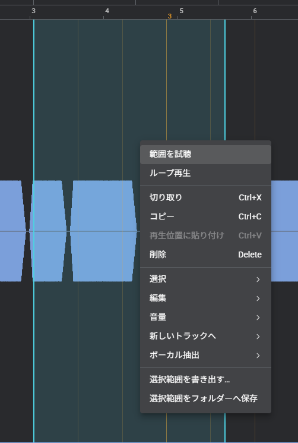

スマホでは、波形を 2 本指でピンチすると横に拡大/縮小する。上部の時間目盛りは、タップで再生位置を移動、ドラッグで再生位置を移動し（端に達すると表示がスクロールする）、動かさずに長押しすると横スクロールになる。

選択範囲の開始/終了は、ステータスバー（スマホは波形の下）の「選択範囲」をクリックすると数値で入力できる。

音量の小さい部分は、Alt + ホイール（または「表示」→「縦の拡大」）で波形を縦に拡大すると確認しやすくなる（最大 64 倍。倍率は波形の右上に表示される）。表示のみの拡大であり、音声は変更されない。

ツールバーの時間表示の再生位置をクリックすると、再生位置を数値で入力できる（「1:23.456」「83.5」など。Enter で移動、Esc で取り消し）。

## 帯パネルの表示

ツールバー（または「表示」メニュー）で、各パネルの表示/非表示を切り替える。上から次の順に並ぶ。少なくとも 1 つは常に表示される。

| パネル | 内容 |
| --- | --- |
| 波形パネル | 音の大きさの形。範囲の選択と再生位置の移動はここで行う |
| スペクトログラムパネル | 周波数ごとの強さを色で表す |
| ピッチパネル | 声の高さの線と、描いた目標のピッチ（[ピッチの編集](#ピッチの編集)） |
| 音量パネル | 描いた音量の曲線（[音量パネル](#音量パネル)） |
| フォルマントパネル | 描いたフォルマントの移動量（[フォルマント](#フォルマント)） |

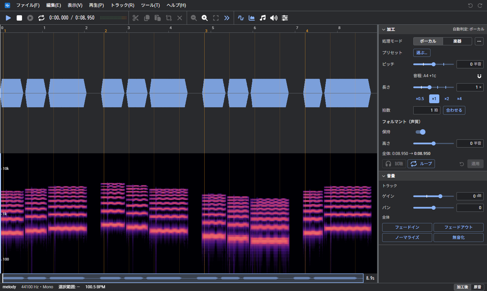

クリックしたパネルにフォーカスが移る（左端に色の線が表示される）。ツールバーのパネルごとの操作と、切り取りやコピーは、フォーカスしているパネルが対象になる。たとえばピッチパネルにフォーカスして Ctrl+C を押すと、音声ではなくピッチの線がコピーされる。

上のパネル（波形とスペクトログラム）と下のパネル（ピッチ、音量、フォルマント）の境界をドラッグすると、高さの配分を変更できる。

## 加工

| 項目 | 内容 |
| --- | --- |
| 処理モード | 「ボーカル」は声など単音向け、「楽器」は和音や打楽器向け |
| ピッチ | 半音単位で上げ下げする（小数も可） |
| 長さ | 倍率で伸縮する（ピッチは変わらない）。×0.5〜×4 のボタンでも選択できる |
| 拍数 | 拍数を入力して「合わせる」をクリックすると、範囲がその拍数の長さ（プロジェクトの BPM で計算）になる倍率が「長さ」に入力される。対象は最後に選択した範囲（なければ全体） |
| フォルマント | 「保持」で声質を保つ。「高さ」で声質のみを変更する |

- 処理モードは、ファイルを開いたときに自動で判定される。「…」から詳細な処理方式も選択できる
- 「ボーカル」「楽器」で使用する処理方式は、「設定」→「デフォルト」で変更できる（初期値はボーカル＝SOLAv2、楽器＝PhaseV）
- ピッチの下には、範囲の現在の音程と変更後の音名が表示される。磁石のボタンで、変更後の音程を最寄りの音名に合わせる

加工の欄の下部のボタン:

| ボタン | 動作 |
| --- | --- |
| 試聴 | 加工後の音を再生する（20 秒以内の範囲） |
| ループ | 範囲を繰り返し再生する。スライダーを操作すると、即座に音に反映される（簡易的な音質）。再生位置の線が移動し、範囲内をクリックするとその位置へ移る。編集中のトラックのみが再生され、メーターやフェーダーは機能しない |
| ↺（リセット） | ピッチ/長さ/フォルマントの値を初期値に戻す |
| 適用 | 選択範囲（なければ全体）に加工を反映する |

### 処理方式（「…」から選択）

処理方式は、長さの変更だけでなくピッチの変更の音質にも影響する。改良版がある従来の方式（SOLA、PSOLA、WSOLA）は、「設定」→「デフォルト」→「従来の処理方式も表示する」を ON にしたときだけ表示される。

処理方式の一覧

| 方式 | 適した素材 |
| --- | --- |
| SOLAv2 | SOLA の改良版。声の 1 周期ずつ切り貼りするため、大きく伸ばしても荒れにくい。元の声らしさが残る。ボーカルの既定 |
| SOLAv3 | SOLAv2 の改良版。前後数周期を平均し、息や声のざらつきを抑えた滑らかな声にする |
| SOLA | 声/単音。短いクロスフェードでつなぐため、音のにじみが少ない |
| PSOLAv2 | PSOLA の改良版。かすれが生じにくい |
| PSOLA | 声。声の周期に合わせて切り貼りする |
| WSOLAv2 | WSOLA の改良版。にじみ/うなりが生じにくい |
| WSOLA | 子音の多い音声。処理が速い |
| HPSS | 打楽器と和音を分離し、それぞれに適した方法で伸縮する。ドラムを含む曲向け。処理に時間がかかる |
| PhaseV v2 | PhaseV の改良版。打楽器などのアタックがにじみにくい |
| PhaseV（Phase Vocoder） | 和音/楽器。滑らかに伸縮する。楽器の既定 |

#### 素材ごとの選択の目安

判断に迷う場合は、まず「ボーカル」「楽器」のボタン（既定の方式）で試し、気になる点があれば次の表から選び直す。音の印象は素材によって異なるため、試聴で聴き比べるのが確実である。

| 素材 | 推奨 | 次の候補 |
| --- | --- | --- |
| 歌声、話し声（声のみ） | SOLAv2 | SOLA |
| 子音の多い話し声、早口 | WSOLAv2 | SOLA |
| 単音の楽器（笛、ベースなど） | SOLA | PhaseV |
| 和音の楽器、パッド、ストリングス（打楽器なし） | PhaseV | PhaseV v2 |
| ピアノ、ギター（立ち上がりのある和音） | PhaseV v2 | PhaseV |
| ドラムを含む曲、伴奏 | HPSS | PhaseV v2 |
| ドラム、打楽器のみ | PhaseV v2 | HPSS |
| ボーカルを含む曲（ミックス） | PhaseV | HPSS |

| 気になる点 | 対処 |
| --- | --- |
| 声がかすれる/ざらつく | SOLA か PSOLAv2 にする |
| 音がにじむ/こもる/浴室のように響く | 声なら SOLA、楽器なら PhaseV v2 か HPSS にする |
| ドラムがぼやける/二重に聞こえる | PhaseV v2 か HPSS にする |
| 伸ばした和音が一瞬途切れる | PhaseV にする（PhaseV v2 は立ち上がりで位相をリセットするため） |
| 声がブザーのように聞こえる | PSOLA 系をやめて SOLA にする |
| 声を大きく伸ばすと荒れる/ガサガサする | SOLAv2 にする |
| 処理に時間がかかる | HPSS 以外にする（その他の方式の 2〜3 倍かかる） |

## ピッチの編集

表示の切り替えで「ピッチ」を ON にすると、波形の下にピッチパネルが表示され、声の高さが線で表される（音名の目盛り付き）。境界をドラッグすると高さを変更できる。

### ペンで描く

ペンのボタンを ON にしてピッチパネルをドラッグすると、目標のピッチを青い線で描ける。

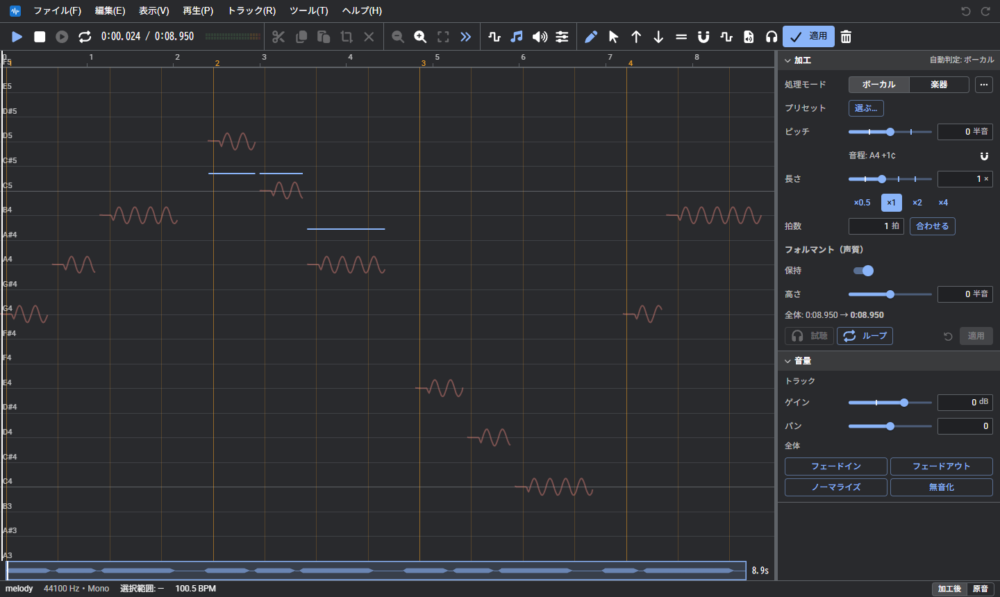

| 操作 | 動作 |
| --- | --- |
| ドラッグ | 描く |
| Shift + ドラッグ | 半音に合わせて描く |
| Alt + ドラッグ | 削除する |

### 掴んで移動する

掴む（矢印）のボタンを ON にすると、ピッチの線を掴んで上下にドラッグできる。線の上にカーソルを合わせると、手の形に変わる。結果は青い線で表示されるため、確認してから「適用」する。

| 操作 | 動作 |
| --- | --- |
| 選択範囲内の線をドラッグ | その範囲のピッチを一括で上下に移動する |
| 選択範囲外の線をドラッグ | 線が途切れる箇所（声のない箇所）までの一続きを上下に移動する |
| Shift + ドラッグ | 半音刻みで移動する |

ペンと掴むは、どちらか一方のみが ON になる。

### 一括で加工する

ツールバーのボタンで、選択範囲（なければ全体）のピッチを一括で加工できる。結果は青い線で表示されるため、確認してから「適用」する。

| ボタン | 動作 |
| --- | --- |
| ↑ / ↓ | 半音上げる/下げる |
| 平らにする | 揺れ（ビブラート）を平滑化して取り除く |
| 音階に揃える… | 指定した音（C4 など）や、最寄りの半音に揃える。既定は指定した音 |
| ビブラート… | 深さと速さを指定して、揺れを加える |
| MIDI の音程を当てはめる… | MIDI ファイルのメロディの音程に合わせる |
| 🎧（試聴） | 適用する前に、線を描いた部分を加工して再生する |
| 適用 / 🗑 | 音に反映する / 線を削除する |

ビブラートの速さには、プロジェクトの BPM に合わせた値が初期値として入力される。

「音階に揃える」の「揺れ（ビブラートなど）を残す」は、既定では OFF（揺れも含めて揃える）。ON にすると、音ごとの中心の高さだけを揃え、揺れは元のまま残す。

「音階に揃える」の「揃えるまでの時間」では、音の開始から何ミリ秒かけて揃えるかを設定する。0 では即座に揃い、機械的な声になる。数十ミリ秒にすると、音の開始部分のしゃくりが残り、自然な声になる。

「表示」→「音符」を ON にすると、ピッチパネルに音ごとの高さ（最寄りの半音）が横棒で表示される。音程に揃えた結果の確認に使用する。「表示」→「ピッチの線」と組み合わせて、線のみ/音符のみ/両方を選択できる。

掴むモードで音符を掴むと、その音（声が途切れるか、1 半音以上変化するまで）を編集できる。

| 操作 | 動作 |
| --- | --- |
| 音符を上下にドラッグ | 半音刻みで音程を変更する |
| 音符を左右にドラッグ | 音の位置を移動する |
| 音符の端をドラッグ | 音を伸縮する |

位置と長さを変更すると、即座に音声を伸縮する。隣の無音部分（短い場合は隣の音）が伸縮し、その他の音の位置と全体の長さは変わらない。

端を隣の音の上まで伸ばすと、伸縮は行わず、重なった部分のピッチを掴んだ音の高さで上書きする（結果は青い線で表示されるため、確認してから「適用」する）。

ピッチパネルを選択した状態では、切り取り/コピー/貼り付け（Ctrl+X / C / V）がピッチの線に対して機能する。範囲を選択してコピーし、再生位置に貼り付けると、同じ節回しを別の箇所に使用できる（結果は青い線で表示される）。

「MIDI の音程を当てはめる」の設定項目

| 項目 | 内容 |
| --- | --- |
| MIDI ファイル | 当てはめるメロディのファイル |
| トラック | MIDI 内で使用するトラック |
| 開始位置 | MIDI の 1 音目を合わせる音声上の位置（秒） |
| テンポ | MIDI のテンポを使用するか、プロジェクトの BPM に合わせるか |
| 移調 | MIDI の音程を半音単位で移動する |
| 揺れを残す/強さ | 元の歌い方の揺れをどの程度残すか |

### ピッチが正しく検出されないとき

範囲を選択して右クリックし、「選択範囲のピッチを強制表示」で声のない箇所にもピッチを表示できる（前後の高さから補間する）。誤って検出されたピッチは「強制非表示」で削除できる。

## 音量

インスペクタの「音量」には、3 つの欄がある。

| 欄 | 内容 |
| --- | --- |
| トラック | トラック全体の音量（ゲイン）とパン。音声は書き換えず、再生と書き出しにそのまま反映される |
| 選択範囲 | 範囲の音量とパン。操作すると再生に即座に反映され、「適用」で音声に書き込む（範囲を選択しているときのみ表示される） |
| ボタン | 選択範囲（なければ全体）に即座に適用する |

| ボタン | 動作 |
| --- | --- |
| フェードイン | 徐々に大きくする |
| フェードアウト | 徐々に小さくする |
| ノーマライズ | 最大の箇所が -1 dB（音割れの手前）になるよう、音量を調整する |
| 無音化 | 音を無音にする |

### 音量パネル

ツールバーの「音量表示」で音量パネルを表示し、ペンで音量の曲線（-24〜+12dB）を描ける。描いた音量は再生に即座に反映される。「適用」で音声に書き込み、🗑 で削除する。Shift + ドラッグで 1dB 刻み、Alt + ドラッグで元の音量に戻す。

## フォルマント

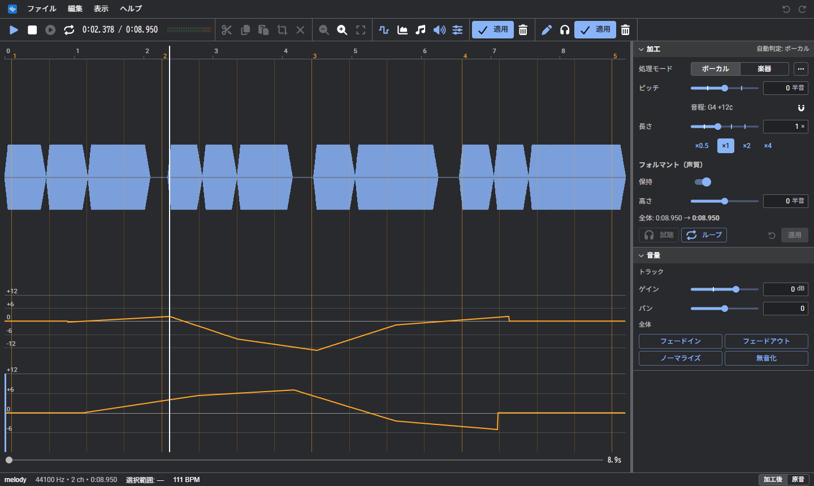

ツールバーの「フォルマント表示」でフォルマントパネルを表示し、ペンでフォルマントの移動量（±12 半音）を描ける。声の高さはそのままで、声質（太さ/細さ）のみが変わる。再生には即座に反映されないため、🎧（試聴）で加工して確認してから「適用」する。Shift + ドラッグで半音刻み、Alt + ドラッグで元に戻す。

## トラック

複数の音声を並べ、同時に再生しながら編集できる。トラックが 2 本以上あるときのみ、ツールバーの下にトラックの欄が表示される。

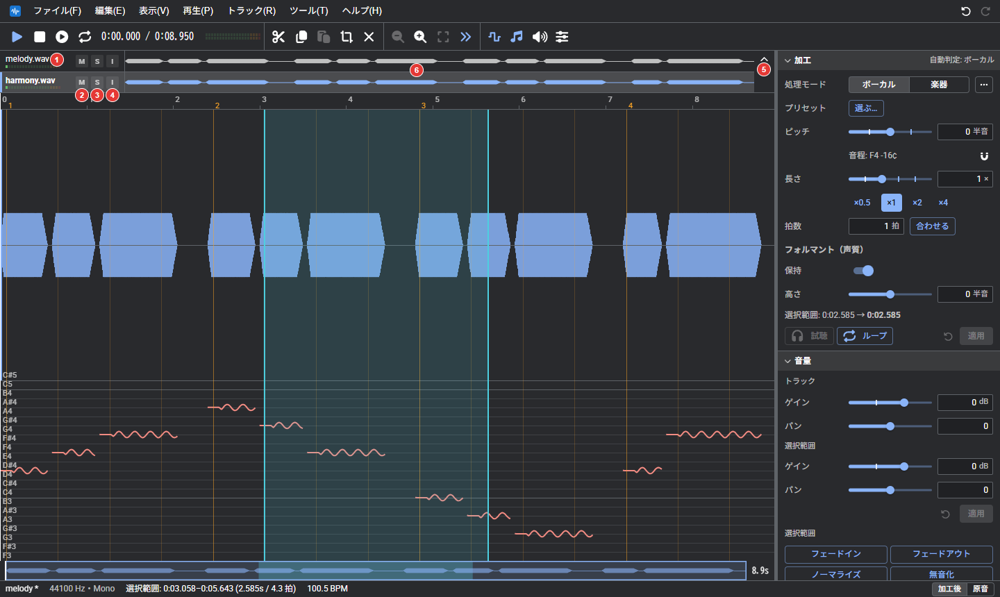

| 番号 | 内容 |
| --- | --- |
| 1 | トラックの名前と音量メーター。編集中のトラックは明るく表示される |
| 2 | M（ミュート）: このトラックを再生しない |
| 3 | S（ソロ）: このトラックのみを再生する |
| ― | I（位相反転）: 波形の上下を反転して再生する。他のトラックとの打ち消し合いの修正/確認に使用する。書き出しにも反映され、プロジェクトに保存される（画像には未掲載） |
| 4 | トラックの欄を折りたたむ（タブ表示にする）/展開する |
| 5 | トラックの波形。再生されないトラックは薄く表示される |

| 操作 | 動作 |
| --- | --- |
| トラックをクリック | そのトラックを編集する |
| Ctrl（⌘）+ クリック | トラックを 1 本ずつ選択に追加/解除する |
| Shift + クリック | 編集中のトラックから、クリックしたトラックまでを一括で選択する |
| ドラッグ | トラックを並び替える |
| 右クリック | トラックのメニューを開く |

トラックのメニューでできること:

- 名前の変更、複製、削除
- ボーカルと伴奏に分離する
- 直下のトラックと統合する、すべて統合する
- 他のトラックの波形を、大きな波形の背後に重ねて表示する

複数選択して右クリックすると、統合、ミュート、ソロ、削除を一括で行える。並び替えは元に戻せる。

「編集」→「無音を挿入…」で、選択範囲の先頭（なければ再生位置）に、秒または拍で指定した長さの無音を挿入する（後続の音声はその分後ろへ移動する）。貼り付けと無音の挿入のあとは、再生位置が挿入した範囲の末尾へ移動する（「設定」→「一般」で無効にできる）。

「編集」→「新しいトラックへ」→「選択範囲を新しいトラックへコピー」で、選択範囲を同じ時刻のまま新しいトラックにコピーする（その他の部分は無音）。「…へ移動」の場合は、元のトラックのその部分が無音になる。

トラックを追加するには、「ファイル」→「ファイルをトラックとして追加…」を使用するか、音声ファイルをドロップする。「トラック」→「空のトラックを追加」では、選択中のトラックと同じ長さの無音のトラックを追加できる（貼り付け先として使用する）。インスペクタの「音量」の「トラック」で、トラックごとの音量（ゲイン）とパンを設定する。これは音声を書き換えず、再生と書き出しにそのまま反映される。

書き出す際は、全トラックをミックスするか、選択中のトラックのみにするかを選択できる（[保存と書き出し](#保存と書き出し)）。

## ボーカル抽出

曲からボーカルのみを抽出したり、伴奏のみを残したりできる。処理はすべてブラウザ内で行う。

| 操作 | 内容 |
| --- | --- |
| 「ツール」→「ボーカルを抽出」 | 選択範囲（なければ全体）を、ボーカルのみにする |
| 「ツール」→「伴奏のみ残す」 | 選択範囲（なければ全体）を、伴奏のみにする |
| 「ツール」→「ボーカルと伴奏を別トラックに分離」 | トラックを、ボーカルと伴奏の 2 本のトラックに置き換える |

初回の利用時は、抽出に使用するデータ（追加機能）のダウンロードを確認する画面が表示される。一度導入すればオフラインでも利用でき、設定から削除できる。

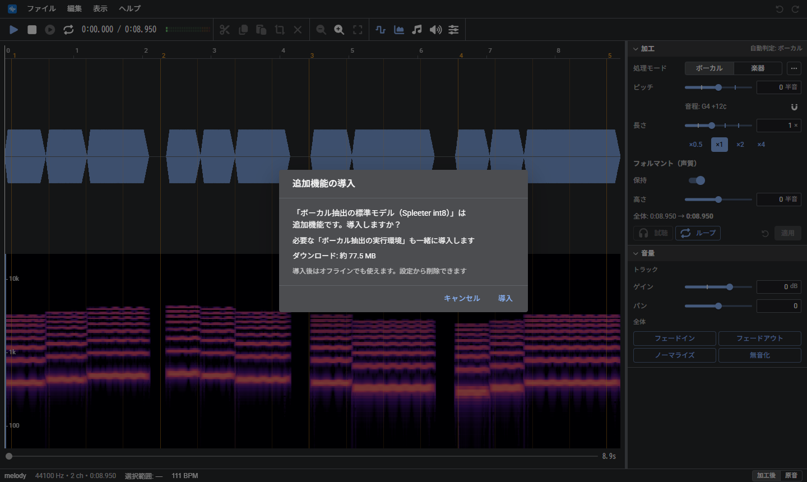

「設定」→「ボーカル抽出」で、次の項目を設定できる。

| 項目 | 内容 |
| --- | --- |
| 利用するモデル | 標準、軽量、高精度から選択する。軽いほどダウンロードのサイズは小さいが、分離の精度は下がる |
| GPU処理を利用する | 対応しているブラウザでは処理が速くなる |
| 高音域を残す | 約 11kHz 以上を残す。声は明るくなるが、シンバルなどが混入しやすい |

## 音声の作成

「ツール」→「音声を作成…」で、加工の素材となる音声を生成し、新しいトラックとして追加できる。

| 項目 | 内容 |
| --- | --- |
| 音色 | 声（あいうえお）か、楽器（4 種類の波形） |
| 生成する音 | 単音（音高と長さを指定）か、MIDI ファイルのメロディ |
| フォルマント/音量 | 声質と音量 |
| ビブラート | 揺れの深さ（半音）と速さ（Hz） |

「試聴」で生成前に確認できる。

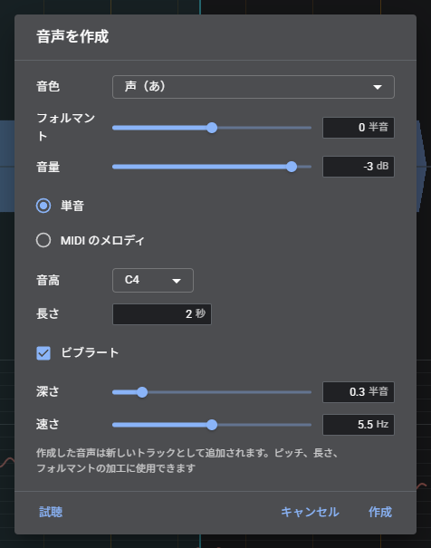

## MIDI に並べる

「ツール」→「素材を MIDI に並べる…」で、選択範囲（なければ全体）を素材として、MIDI の各音符の位置にその高さで配置した新しいトラックを作成する。処理方式とフォルマント保持は、加工の欄の設定を使用する。

| 項目 | 内容 |
| --- | --- |
| トラック/開始位置/テンポ/移調 | MIDI のどのトラックを、どの位置から、どの速さで使用するか |
| 素材の音程 | 素材の元の高さ。選択範囲を解析した値が初期値になる。音符との差の分だけピッチを変更する |
| 長さ | 伸縮: 音符の長さに合わせて伸縮する / 繰り返し: 素材を繰り返して埋める / そのまま: 長さを変えず、音符より長い部分は切り捨てる |

## テンポ（BPM）と拍の線

ファイルを開くと、テンポが自動で解析され、BPM と 1 拍目の位置が設定される（設定で無効にできる。無効の場合は「設定」→「デフォルト」の BPM が使用される）。解析したテンポは、実際の 2 倍や半分になる場合がある。画面下部の BPM の表示（「120 BPM」など）をクリックすると、次の方法で修正できる。

| 方法 | 内容 |
| --- | --- |
| 候補から選択 | 自動解析で検出された候補から選択する |
| ×2 / ÷2 | 現在の BPM を 2 倍/半分にする |
| タップで計測 | 拍に合わせてタップした間隔から BPM を算出する |
| 数値で入力 | BPM を直接入力する |
| 再解析 | 再度自動で解析する |

「設定」→「テンポ」→「テンポ変更時に全体を伸縮する」を ON にすると、BPM を数値で入力したときに、全トラックがそのテンポの長さに伸縮する（ピッチは変わらない。処理方式は加工の欄で選択しているもの）。候補からの選択/×2/÷2/タップは、テンポの誤検出を修正する操作のため伸縮しない。元に戻すと音声は復元されるが、BPM は復元されない。

「設定」→「プロジェクト」で BPM、拍子、1 拍目の位置を設定すると、波形に拍の線と小節番号が表示される（拍の線の表示は「設定」→「テンポ」で切り替える）。テンポはプロジェクトごとに保存される。範囲の端や再生位置をドラッグすると拍の線に吸着する（Alt を押している間は吸着しない）。

## マーカー

再生位置に名前付きの目印を追加できる（「編集」→「マーカー」→「マーカーを追加」または M キー）。目盛りを右クリックすると、その位置からの再生、再生位置の移動、再生位置の入力、マーカーの追加のほか、その位置にあるマーカーの名前の変更/削除ができる。名前は M1、M2… から始まり、目盛り上の名前をダブルクリックすると変更できる。

- 目盛り上のマーカー（線か名前）をドラッグすると、位置を移動できる（拍の線に吸着する。Alt を押している間は吸着しない）。動かさずにクリックした場合は、再生位置がその位置へ移動する
- 選択範囲の端や再生位置は、近くのマーカーに吸着する（拍の線より優先。Alt を押している間は吸着しない）
- 「再生」→「前のマーカーへ/次のマーカーへ」（Ctrl + ← / →）で移動する
- 名前の変更/削除は、再生位置にあるマーカー、またはそれより前で最も近いマーカーが対象
- プロジェクトに保存される。元に戻す（Ctrl+Z）の対象にはならない

## 操作履歴

「編集」→「操作履歴…」で、これまでの操作が一覧で表示される。クリックした操作の直後の状態へ、一括で戻る/進むことができる（「開いたとき」をクリックすると最初の状態に戻る）。

## 保存と書き出し

| 操作 | 内容 |
| --- | --- |
| プロジェクトを保存（Ctrl+S） | 作業内容を一括で .wvsp ファイルに保存する |
| 音声ファイルを書き出す（Ctrl+Shift+S） | 音声をファイルに保存する |

- プロジェクトには、原音、加工後の音声、設定が含まれる。元に戻す履歴は含まれない
- トラックが 2 本以上あるときは、「全トラックのミックス」か「選択中のトラックのみ」かを選択できる。ミックスは、再生対象のトラック（ミュート/ソロに従う）を合成した 1 つの音声になる

書き出せる形式

| 形式 | 拡張子 | 設定項目 |
| --- | --- | --- |
| WAV | .wav | 16-bit / 24-bit / 32-bit float |
| MP3 | .mp3 | 96〜320 kbps。サンプルレートは 32 / 44.1 / 48 kHz |
| Opus | .ogg | 64〜256 kbps。48 kHz 固定。対応しているブラウザのみ |

形式のほかに、サンプルレート、モノラルにするか、範囲（全体か選択範囲のみか）、ファイル名を設定する。

Ctrl+S と Ctrl+Shift+S の割り当ては設定で入れ替えられる。

Chrome や Edge では、保存・書き出しのときに保存先を選ぶ画面が表示される（Firefox や Safari では、ブラウザのダウンロードとして保存される）。開く・保存するフォルダは、プロジェクトと音声ファイルで別々に記憶され、次回はそのフォルダから選択画面が開く。「設定」→「全般」→「開く・保存するフォルダを記憶する」を OFF にすると、毎回「最初に開くフォルダ」から開く。

「ファイル」→「最近使用したファイル」から、最近開いたファイル（最大 8 件）を開き直せる（Chrome や Edge のみ。開くときにブラウザが読み込みの許可を求める場合がある）。ファイルを移動・削除した場合は一覧から外れる。

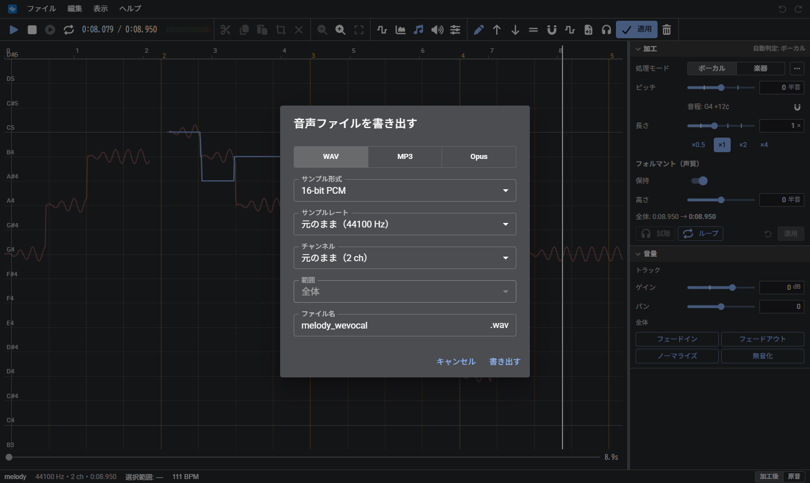

プロジェクト名は、画面左下の名前をクリックするか、「設定」→「プロジェクト」で変更できる。書き出すファイル名の初期値はプロジェクト名になる（名前を変更していない場合は「元のファイル名_wevocal」）。

## 設定

「ファイル」→「設定…」（スマホは「⋮」→「設定」）。

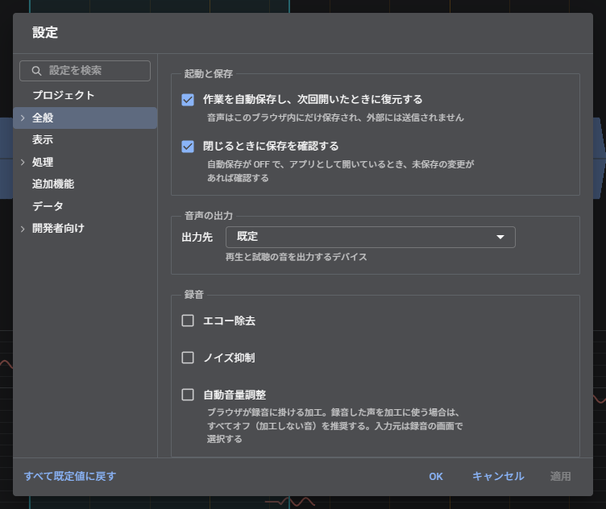

| 分類 | 項目 |
| --- | --- |
| プロジェクト | プロジェクト名、BPM、拍子、1 拍目の位置 |
| 全般 | 自動保存、ダブルクリックでスライダーを既定値に戻す、ホイールの操作、開く/保存するフォルダの記憶、最初に開くフォルダ、最近使用したファイルの記録、開いたときの処理モード、元に戻せる回数、更新の確認 |
| デフォルト | ボーカル/楽器のモードで使用する処理方式、従来の処理方式も表示する、テンポを自動解析しないときの BPM |
| 表示 | テーマ（ライト、ダーク、ブラウザに合わせる）、言語、音量メーター |
| ピッチ解析 | 解析する音域、声と判定する基準の厳しさ、無音と判定する音量（変更すると再解析する） |
| テンポ | 開いたときの自動解析、拍の線の表示 |
| キー操作 | Ctrl+S の動作 |
| ボーカル抽出 | モデル、GPU、高音域を残す、抽出に使用するデータの導入/削除 |
| データ | ブラウザ内の使用量の確認と、保存したデータの削除 |
| 開発者向け | デバッグ表示（Ctrl+Shift+D でも切り替え。再生に使う AudioContext の状態も表示する）、停止中は音声処理を一時停止する、iOS の消音スイッチ ON でも再生する、ダイアログの表示 |

### 設定画面の操作

| 操作 | 動作 |
| --- | --- |
| 検索欄に入力 | 名前や説明に一致する項目を検索する |
| ↑ / ↓/Home / End | 分類を切り替える（分類の一覧にフォーカスがあるとき） |
| Tab | 分類の一覧から右側の項目へ移動する |
| Enter | OK（設定を確定して閉じる） |
| Esc | 検索語を消去する。検索語がない場合は、設定画面を閉じる |

- パソコンでは、OK をクリックせずに閉じると、変更内容は破棄される
- スマホでは、分類の一覧から各画面へ移動する。変更内容は即座に反映される
- 「プロジェクト」の分類のみ、パソコンでも変更した時点で反映される

### ダイアログの操作

書き出しや音声の作成などのダイアログでは、Enter で主要なボタン（「書き出す」「作成」など）を実行し、Esc で閉じる。Tab でボタンにフォーカスを移して Enter を押すと、そのボタンが実行される。

設定/書き出し/音声の作成/ヘルプ（ショートカット一覧、このアプリについて）は、アプリとしてインストールして Chrome や Edge で使用しているときは、別ウィンドウ（ポップアップ）で開く。それ以外ではページ内のダイアログで開く。「設定」→「開発者向け」→「ダイアログの表示」で表示方法を固定できる。

| 表示方法 | 内容 |
| --- | --- |
| 自動 | 上記のとおり（既定） |
| ダイアログ / `<dialog>` / Popover API | ページ内に表示する。Popover API は開いたまま背後も操作できる |
| ポップアップ / 別タブ | 別ウィンドウ/別タブに表示する |
| サブウィンドウ | 別ウィンドウに表示し、位置を記憶する（別のディスプレイにも配置できる。初回に許可を求められる） |
| PiP | 常に最前面に表示される小さなウィンドウに表示する |

別ウィンドウを開けない場合は、ページ内のダイアログで表示する。

## このアプリについて

「ヘルプ」→「このアプリについて」で、バージョン、作者、ライセンスを確認できる。

## 新しいバージョン

新しいバージョンが公開されると、画面の右下に「新しいバージョンがあります」と表示される。「更新」をクリックすると切り替わる（作業内容は自動保存から復元される）。× で通知を閉じられる。「ヘルプ」→「更新を確認」や、「設定」→「全般」の「今すぐ確認」でも確認でき、新しいバージョンがあればそこから更新できる。

## キーボード操作

| キー | 動作 |
| --- | --- |
| Space | 再生 / 一時停止 |
| Ctrl+Z / Ctrl+Y | 元に戻す / やり直す |
| Ctrl+X / C / V | 切り取り / コピー / 再生位置に貼り付け |
| Ctrl+A / Esc | すべて選択 / 選択解除 |
| Ctrl+O | 開く |
| ← / → | 再生位置を 1 拍ずつ移動する |
| Shift+← / → | 再生位置を 0.1 秒ずつ移動する |
| Home / End | 再生位置を先頭 / 末尾へ移動する |
| M | 再生位置にマーカーを追加する |
| Ctrl + ← / → | 前 / 次のマーカーへ移動する |
| Alt + ホイール | 波形を縦に拡大/縮小する |
| Ctrl+E | 音声ファイルを書き出す |
| Ctrl+S / Ctrl+Shift+S | プロジェクトを保存 / 音声ファイルを書き出す |
| ↑ / ↓ | 選択範囲のピッチを半音上げる / 下げる（ピッチパネルを表示しているとき） |
| Shift+↑ / ↓ | 選択範囲のピッチを 0.1 半音上げる / 下げる |
| Alt / F10 → 英字 | メニューバーに移動し、「ファイル(F)」の F などでそのメニューを開く（[パソコン](#パソコン)） |
| Alt+英字 | メニューを直接開く（アプリとしてインストールして起動しているときのみ） |

- 切り取り、コピー、貼り付けは、フォーカスしているパネルが対象になる。ピッチパネルの場合は、ピッチの線が対象になる
- ← / → は、拍の線を表示していないときは 1 秒ずつ移動する
- Ctrl+S と Ctrl+Shift+S の割り当ては、設定で入れ替えられる

一覧は「ヘルプ」→「ショートカット」でも確認できる。

## 困ったとき

| 症状 | 対処 |
| --- | --- |
| 「試聴」が押せない | 範囲を 20 秒以内/1 つにする。長い場合は「ループ」で再生する |
| 加工後の声がこもる/機械的になる | 処理方式を変更する（「…」）。声の場合は「フォルマント保持」を ON にする |
| ピッチの線が途切れる | 範囲を選択し、右クリックの「選択範囲のピッチを強制表示」で補間する |
| 前回の作業が自動で復元される | 「設定」→「全般」の「作業を自動保存し、次回開いたときに復元する」を OFF にする |
| ボーカル抽出で声と伴奏が正しく分離されない | 「設定」→「ボーカル抽出」でモデルを「高精度」に変更する |
| 抽出した声にシンバルなどが混入する | 「高音域を残す」を OFF にする |
| 抽出した声がこもって聞こえる | 「高音域を残す」を ON にする |
| ボーカル抽出が遅い | モデルを「軽量」にするか、「GPU処理を利用する」を ON にする |
| ボーカル抽出が失敗する/結果が不正確 | 「GPU処理を利用する」を OFF にする。スマホではモデルを「軽量」にする |
| ファイルを開けない | WAV か MP3 に変換してから開く |
| iPhone / iPad で音が出ない | 「設定」→「開発者向け」の「停止中は音声処理を一時停止する」を OFF にする。「開発者向け」→「デバッグ表示」を ON にし、左下の「audio」の行が running 以外なら、その内容を報告する |
