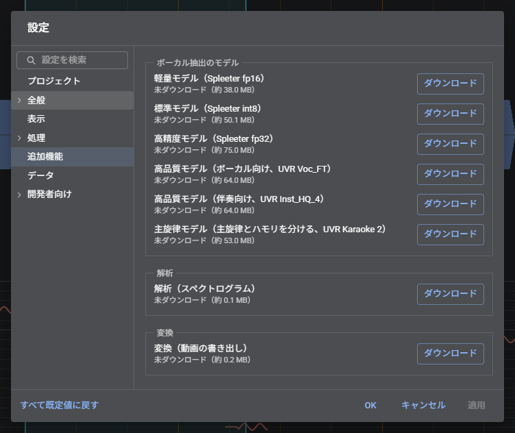

# 設定
設定画面とダイアログの操作。

「ファイル」→「設定…」（スマホは「⋮」→「設定」）。

| 分類 | 項目 |
| --- | --- |
| プロジェクト | プロジェクト名、BPM、拍子、1 拍目の位置 |
| 全般 | 自動保存、閉じるときに保存を確認する、音声の出力先（Chrome、Edge のみ。デバイス名が表示されない場合は「名前を表示」をクリックし、マイクの使用を許可する）、録音（エコー除去、ノイズ抑制、自動音量調整。既定はすべてオフ）、更新の確認 |
| 全般 → 編集 | 原音を保持する、元に戻せる回数とメモリ、ダブルクリックでスライダーを既定値に戻す、波形の挿入後に再生位置を末尾へ移動 |
| 全般 → キーとマウス | ホイールの操作、Ctrl+S の動作、ショートカットの割り当て |
| 全般 → ファイル | 開く場所と保存先の記憶、最初に開くフォルダ、最近使用したファイルの記録（Chrome、Edge のみ） |
| 表示 | テーマ（ライト、ダーク、ブラウザに合わせる）、言語、画面の大きさ（文字、入力欄、ボタンなどをまとめて 90〜150% に拡大、縮小する）、音量メーター、範囲選択中も数値を更新、ミニマップの再生位置 |
| 処理 | ボーカル/楽器のモードで使用する処理方式、従来の処理方式も表示する、開いたときの処理モード、メモリを節約する |
| 処理 → ピッチ解析 | 解析する音域、声と判定する基準の厳しさ、無音と判定する音量（変更すると再解析する）、「平らにする」の強さ |
| 処理 → テンポ | 開いたときの自動解析、テンポを自動解析しないときの BPM、拍の線の表示、テンポ変更時に全体を伸縮する |
| 処理 → ボーカル抽出 | モデル、メモリを空けてから抽出する、GPU、高音域を残す、抽出のメモリの上限（モデルのダウンロードと削除は「追加機能」） |
| 追加機能 | ボーカル抽出のモデル、解析（スペクトログラム）、変換（動画の書き出し）のダウンロードと削除 |
| データ | ブラウザ内の使用量の確認、保存したデータの削除、データを削除されにくくする申請 |
| 開発者向け | デバッグ表示（Ctrl+Shift+D でも切り替え。再生に使う AudioContext の状態も表示する）、開発版の更新を受け取る、選択範囲の保存ボタンを表示する、ファイル選択の方式（書き出しの保存先フォルダーを使うかもこれで決まる）、ダイアログの表示 |
| 開発者向け → 音声処理 | フォルマント補正の高速計算、ループ試聴の位置合わせ、継ぎ目のフェード、停止中は音声処理を一時停止する、iOS の消音スイッチ ON でも再生する |
| 開発者向け → 試験的機能 | 試験的な処理方式を使用する（Specraw。往復や重ねた加工で劣化しにくいことを目指す、開発中の方式）、「和音を分ける」を表示する（2 つの声を、高い方と低い方、または大きい方と小さい方の 2 つのトラックに分ける。選択範囲があれば、その範囲だけ。単純な和音向け）、GPUでの並列処理を有効する（20 秒以上の音のピッチ変換を 10 秒ずつに分け、CPU の複数のコアで同時に行う。区間ごとに最大 5ms ずれる） |
| 開発者向け → 診断 | ボーカル抽出の診断 |

「追加機能」では、ボーカル抽出のモデル、解析、変換のダウンロードと削除ができる。ダウンロードしたものはオフラインでも使用できる。

「全般」と「処理」の下の分類は、一覧で親の分類の下に表示される。「全般」→「ファイル」は Chrome、Edge のパソコン版のみ表示される。

## 設定画面の操作

| 操作 | 動作 |
| --- | --- |
| 検索欄に入力 | 名前や説明に一致する項目を検索する |
| ↑ / ↓/Home / End | 分類を切り替える（分類の一覧にフォーカスがあるとき） |
| Tab | 分類の一覧から右側の項目へ移動する |
| Enter | OK（設定を確定して閉じる） |
| Esc | 検索語を消去する。検索語がない場合は、設定画面を閉じる |

- パソコンでは、OK をクリックせずに閉じると、変更内容は破棄される
- スマホでは、分類の一覧から各画面へ移動する。変更内容は即座に反映される
- 「プロジェクト」の分類のみ、パソコンでも変更した時点で反映される

## ダイアログの操作

書き出しや音声の作成などのダイアログでは、Enter で主要なボタン（「書き出す」「作成」など）を実行し、Esc で閉じる。Tab でボタンにフォーカスを移して Enter を押すと、そのボタンが実行される。

設定/書き出し/音声の作成/ヘルプ（ショートカット一覧、このアプリについて）は、アプリとしてインストールして Chrome や Edge で使用しているときは、別ウィンドウ（ポップアップ）で開く。それ以外ではページ内のダイアログで開く。「設定」→「開発者向け」→「ダイアログの表示」で表示方法を固定できる。

| 表示方法 | 内容 |
| --- | --- |
| 自動 | 上記のとおり（既定） |
| ダイアログ / `<dialog>` / Popover API | ページ内に表示する。Popover API は開いたまま背後も操作できる |
| ポップアップ / 別タブ | 別ウィンドウ/別タブに表示する |
| サブウィンドウ | 別ウィンドウに表示し、位置を記憶する（別のディスプレイにも配置できる。初回に許可を求められる） |
| PiP | 常に最前面に表示される小さなウィンドウに表示する |

別ウィンドウを開けない場合は、ページ内のダイアログで表示する。
