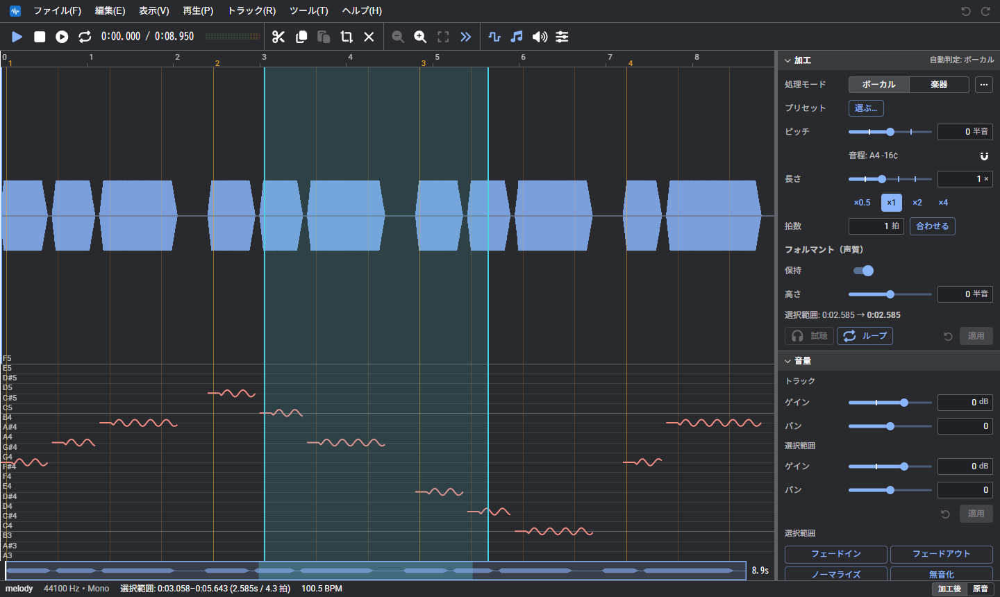

# WeVocalSynth
WeVocalSynth は、Web ブラウザで音声素材のピッチ（音の高さ）と長さを編集する音声加工ツールである。 
インストールは不要。音声ファイルはサーバーへ送らず、処理はすべてブラウザ内で行う。

- アプリ: https://wevocalsynth.pitan76.net/
- ソースコード: https://github.com/PTOM76/wevocalsynth

## はじめに
1. [アプリ](https://wevocalsynth.pitan76.net/)を開き、音声ファイルを画面にドラッグ＆ドロップする（または「ファイル」→「開く…」）
2. 波形上でドラッグして範囲を選び、インスペクタの「加工」でピッチや長さを設定して「適用」する
3. 「ファイル」→「音声ファイルを書き出す…」で保存する

詳しくは [基本の流れ](basics.md) を参照。言葉の意味は [用語](glossary.md) にまとめている。

## できること
| 分類 | 機能 |
| --- | --- |
| 加工 | ピッチ変更（0.01 半音単位）、時間伸縮、フォルマント保持、素材に合わせて選べる処理方式、逆再生 |
| ピッチ | ピッチ曲線の表示とペンでの描き直し、半音上下、平らにする、音階に揃える、ビブラート |
| 編集 | 範囲選択（複数可）、切り取り、コピー、貼り付け、音量の編集、マーカー、元に戻す、操作履歴 |
| トラック | 複数トラック、トラックごとの音量とパン、ミュートとソロ |
| ボーカル抽出 | 曲からボーカルと伴奏を取り出す（ブラウザ内で処理） |
| 音声の作成 | 声や楽器の音色で、単音または MIDI のメロディから音声を作る |
| 保存 | WAV / MP3 / Opus の書き出し、プロジェクトの保存（.wvsp）、自動保存と復元 |
| その他 | パソコンとスマホに対応、オフラインで使える、日本語、英語、韓国語、中国語 |

## 使い方
| ページ | 内容 |
| --- | --- |
| [画面](screen.md) | パソコンとスマホの画面の各部の名前と役割 |
| [基本の流れ](basics.md) | 開いてから書き出すまでの流れ、対応ファイル、データの保存先 |
| [波形の操作](waveform.md) | 波形の選択、拡大、移動と、帯パネルの表示 |
| [加工](processing.md) | 選択範囲のピッチ、長さ、声質の加工と、処理方式の選び方 |
| [ピッチの編集](pitch.md) | ピッチ曲線を描く、掴んで動かす、一括で加工する |
| [音量とフォルマント](volume.md) | 音量とフォルマント（声質）の編集 |
| [トラック](tracks.md) | 複数の音声を重ねるトラックの操作 |
| [ボーカル抽出](extract.md) | 曲から声を取り出す |
| [音声の作成と MIDI](create.md) | 音声の作成と、MIDI に並べる |
| [テンポとマーカー](tempo.md) | テンポ（BPM）、拍の線、マーカー |
| [保存と書き出し](save.md) | 操作履歴、保存、書き出し |
| [設定](settings.md) | 設定画面とダイアログの操作 |
| [キーボード操作](shortcuts.md) | キーボードで使える操作の一覧 |
| [困ったとき](troubleshooting.md) | うまく動かないときの対処 |

## その他
- [バージョン履歴](../VERSION.md)
- [用語](glossary.md)
